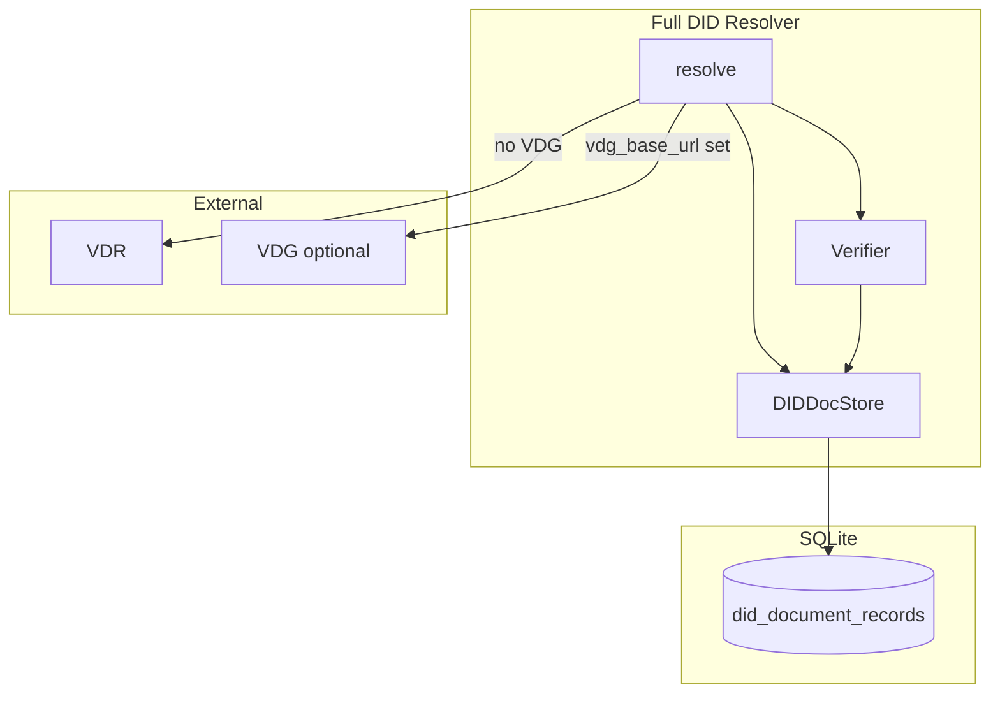

# did:webplus Full DID Resolver - Python Implementation Plan

## Summary of Spec Requirements

From the [did:webplus spec](https://ledgerdomain.github.io/did-webplus-spec):

- **Full DID Resolver**: Fetches, verifies, and stores all DID documents in a microledger for each DID. Supports offline resolution when docs are cached, historical resolution by `selfHash`/`versionId`, and DID fork detection.
- **DID format**: `did:webplus:<host>[%3A<port>][:<path>]:<root-self-hash>`
- **Resolution URL**: DID-to-URL mapping (localhost→http, else https; append `/did-documents.jsonl`; percent-decode; replace `:` with `/`; drop prefix)
- **Microledger**: Newline-delimited JCS-serialized DID documents at resolution URL
- **DID documents**: Self-Hashed Signed Data with `id`, `selfHash`, `prevDIDDocumentSelfHash`, `updateRules`, `proofs`, `validFrom`, `versionId`, verification methods

## Architecture




## Project Structure

```
did-webplus-py/
├── pyproject.toml / setup.py
├── requirements.txt
├── README.md
├── docs/
│   └── TEST_VECTOR_REQUESTS.md   # Request spec for LedgerDomain test vectors
├── did_webplus/
│   ├── __init__.py
│   ├── did.py              # DID parsing, URL mapping
│   ├── document.py         # DID document model, validation
│   ├── selfhash.py         # Self-hash verification (JCS + BLAKE3)
│   ├── verification.py     # Update rules, proofs (JWS)
│   ├── store.py            # SQLite storage (DIDDocStore)
│   ├── http_client.py      # Fetch did-documents.jsonl (incl. Range)
│   └── resolver.py         # FullDIDResolver
└── tests/
    └── ...
```

## Key Implementation Details

### 1. DID Parsing and URL Mapping ([did.py](did-webplus-py/did_webplus/did.py))

- Parse `did:webplus:<host>[%3A<port>][:<path>]:<root-self-hash>`
- Extract query params: `selfHash`, `versionId` from DID URL
- Resolution URL: `{http|https}://{host}[:{port}]/{path}/{root-self-hash}/did-documents.jsonl`
- Handle localhost → `http://`, else `https://`

### 2. DID Document Model ([document.py](did-webplus-py/did_webplus/document.py))

- Pydantic/dataclass for: `id`, `selfHash`, `prevDIDDocumentSelfHash`, `updateRules`, `proofs`, `validFrom`, `versionId`, verification methods
- Root: `versionId=0`, `prevDIDDocumentSelfHash` omitted
- Non-root: `prevDIDDocumentSelfHash` = prev's `selfHash`, `versionId` = prev + 1, `validFrom` > prev

### 3. Self-Hash Verification ([selfhash.py](did-webplus-py/did_webplus/selfhash.py))

Per [selfhash](https://github.com/LedgerDomain/selfhash) and spec:

- Self-hash uses JCS (RFC 8785) + BLAKE3 (multibase `u` = base64url)
- Verify: replace self-hash slots with placeholder, JCS-serialize, BLAKE3 hash, compare
- Placeholder: `E` + base64url(32 zero bytes) for BLAKE3-256
- Use `jcs` or `rfc8785` for JCS; `blake3` for hashing; `multiformats` or manual base64url for multibase

### 4. Update Rules and Proofs ([verification.py](did-webplus-py/did_webplus/verification.py))

Per the current spec and [Rust implementation](https://github.com/LedgerDomain/did-webplus/blob/main/did-webplus/core/src/did_document.rs):

- Parse `updateRules`: `all`, `any`, `atLeast`/`of`, `key`, `hashedKey`, `weight`
- Verify JWS proofs over bytes-to-sign (JCS of doc with proofs cleared and self-hash slots = placeholder)
- Each proof's JWS header `kid` = base64url-encoded multicodec public key; verify signature over detached payload
- Root: verify proofs are valid JWS (no previous doc to satisfy)
- Non-root: keys from valid proofs must satisfy previous doc's `updateRules`

### 5. SQLite Storage ([store.py](did-webplus-py/did_webplus/store.py))

Schema (from [Rust migration](https://github.com/LedgerDomain/did-webplus/blob/main/did-webplus/doc-storage-sqlite/migrations/20240515005548_initial_schema.up.sql)):

```sql
CREATE TABLE did_document_records (
  self_hash TEXT NOT NULL PRIMARY KEY,
  did TEXT NOT NULL,
  version_id BIGINT NOT NULL,
  valid_from TEXT NOT NULL,  -- ISO 8601
  did_documents_jsonl_octet_length BIGINT NOT NULL,
  did_document_jcs TEXT NOT NULL,
  UNIQUE(did, version_id),
  UNIQUE(did, valid_from),
  UNIQUE(did, did_documents_jsonl_octet_length)
);
```

Operations: `add_did_documents`, `get_by_self_hash`, `get_by_version_id`, `get_latest`

### 6. HTTP Client ([http_client.py](did-webplus-py/did_webplus/http_client.py))

- `fetch_did_documents_jsonl(did, known_octet_length=0, vdg_base_url=None)` → new content
- If `vdg_base_url`: GET `{vdg_base_url}/webplus/v1/fetch/{did}/did-documents.jsonl` (per Rust [http.rs](https://github.com/LedgerDomain/did-webplus/blob/main/did-webplus/resolver/src/http.rs))
- Else: GET resolution URL from DID (VDR)
- Use `Range: bytes={known_octet_length}-` for incremental fetch
- Handle 206 (partial), 200 (full), 416 (up-to-date when Content-Range matches)

### 7. Full Resolver ([resolver.py](did-webplus-py/did_webplus/resolver.py))

Constructor: `FullDIDResolver(store, vdg_base_url=None, http_options=None)`

Resolution flow (mirroring [DIDResolverFull](https://github.com/LedgerDomain/did-webplus/blob/main/did-webplus/resolver/src/did_resolver_full.rs)):

1. Parse DID/query params
2. Try local store: by `selfHash`, `versionId`, or latest
3. If missing: fetch from VDG (if `vdg_base_url`) or VDR (Range GET), parse JSONL, validate chain (full verification), store
4. Return `(did_document, did_document_metadata, did_resolution_metadata)` per W3C DID Resolution

Output format:

- `didDocument`: JCS string of resolved DID document
- `didDocumentMetadata`: `created`, `updated`, `versionId`, `deactivated`, etc.
- `didResolutionMetadata`: `contentType`, `fetchedUpdatesFromVdr`, `didDocumentResolvedLocally`

## Dependencies

- **Python 3.10+** (pyproject.toml: `requires-python = ">=3.10"`)
- `jcs` or `rfc8785` – JCS canonicalization
- `blake3` – hashing
- `httpx` – async HTTP (Range support)
- `aiosqlite` or `sqlite3` – SQLite
- `pydantic` – document validation
- `python-jose` or `jwcrypto` – JWS verification
- `multiformats` (optional) – multibase/multicodec

**Dev/test**: `pytest`, `pytest-asyncio`, `respx` (or `httpx` MockTransport) for HTTP mocking

## Scope

- **Full verification** from the start: self-hash, chain integrity, JWS proofs, and update rules evaluation
- **Optional VDG base URL**: Resolver accepts `vdg_base_url` to fetch via VDG (`/webplus/v1/fetch/{did}/did-documents.jsonl`) instead of VDR when provided
- **Python 3.10+**: Use type hints and `match` statements throughout

## Testing Strategy

### 1. Unit Tests (Pure Logic, No Network)

- **DID parsing** ([tests/test_did.py](did-webplus-py/tests/test_did.py)): Parse valid DIDs (with/without port, path, query params); reject malformed; DID-to-URL mapping for all spec examples
- **Self-hash** ([tests/test_selfhash.py](did-webplus-py/tests/test_selfhash.py)): Verify known self-hashed documents; reject tampered; placeholder handling
- **Document validation** ([tests/test_document.py](did-webplus-py/tests/test_document.py)): Root vs non-root constraints; chain linkage; validFrom/versionId monotonicity
- **Update rules** ([tests/test_verification.py](did-webplus-py/tests/test_verification.py)): `all`, `any`, `atLeast`/`of`, `key`, `hashedKey`, `weight`; proof verification with valid/invalid JWS
- **Store** ([tests/test_store.py](did-webplus-py/tests/test_store.py)): CRUD, uniqueness constraints, `did_documents_jsonl_octet_length` accumulation

### 2. Test Vectors (Request Document)

- **In-project request file**: [docs/TEST_VECTOR_REQUESTS.md](did-webplus-py/docs/TEST_VECTOR_REQUESTS.md) – markdown describing requested vectors (canonical docs, microledgers, negative cases, resolution expectations, update rules variants). Can be shared with LedgerDomain or filed as an issue when ready.
- **Spec examples**: Extract and lock any examples from [did-webplus-spec](https://ledgerdomain.github.io/did-webplus-spec) into `tests/fixtures/`

### 3. Test Ownership

Tests are written and owned by this project. We are responsible for their completeness; we do not reverse-engineer or harvest tests from the Rust implementation.

### 4. Integration Tests (With Mock or Live VDR)

- **Mock HTTP** ([tests/test_resolver_integration.py](did-webplus-py/tests/test_resolver_integration.py)): Use `respx` or `httpx.MockTransport` to serve `did-documents.jsonl`; assert full resolve → store → offline resolve
- **Range requests**: Verify incremental fetch (Range header) and 416 handling
- **VDG path**: When `vdg_base_url` set, assert requests go to VDG URL pattern, not VDR

### 5. End-to-End (Optional, Requires Rust VDR)

- **Docker Compose**: Use [did-webplus VDR](https://github.com/LedgerDomain/did-webplus/tree/main/did-webplus/vdr) in CI; create DID via CLI, resolve via Python resolver
- **Cross-implementation**: Resolve same DID with Rust CLI and Python; compare `didDocument` and metadata

### 6. Test Fixture Layout

```
tests/
├── fixtures/
│   ├── did_documents/       # Sample root/non-root JCS, valid + invalid
│   ├── microledgers/        # did-documents.jsonl samples
│   └── expected/            # Expected resolution outputs (JSON)
├── test_did.py
├── test_selfhash.py
├── test_document.py
├── test_verification.py
├── test_store.py
├── test_http_client.py
├── test_resolver_integration.py
└── conftest.py              # Shared fixtures, temp SQLite DB
```

