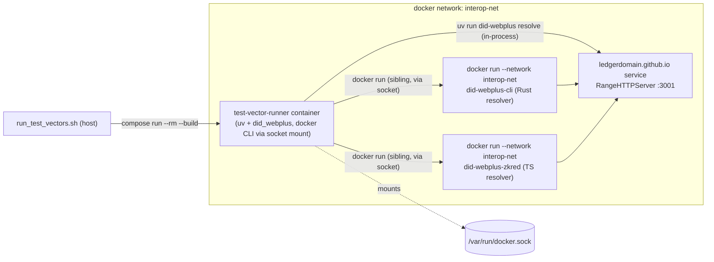

# Dockerize the test-vector runner (drop `/etc/hosts` for that suite)

## Why this design (research findings)

I initially sketched "cleaner" as one mega-image with the Rust CLI binary copied in via multi-stage build. I checked that concretely:

- `ghcr.io/ledgerdomain/did-webplus-cli:v0.1.5` is Debian **12 (bookworm)**, dynamically linked against `libssl.so.3`/`libcrypto.so.3`/glibc.
- `python:3.12-slim` (today) is Debian **13 (trixie)**, different OpenSSL/glibc minor versions.

Copying the compiled Rust binary across those bases would work today but silently couples this repo's runner image to matching glibc/OpenSSL lineage of an upstream image we don't control — a future base-image bump on either side breaks it with no compile-time signal. That's not actually "cleaner."

The design below keeps Rust/Zkred as their existing separate Docker images (unchanged build steps), but runs everything — the Python orchestrator *and* the sibling `docker run` calls for Rust/Zkred — on one explicit, named Docker network. Docker's embedded DNS resolves compose service names for any container attached to that network, so the service name `ledgerdomain.github.io` just resolves, with zero `/etc/hosts` editing and zero binary-compatibility risk.

## Architecture



Name resolution: compose gives every service on a user-defined network a DNS entry matching its service name. `ledgerdomain.github.io` and `test-vector-runner` both join the new named network `interop-net`; the sibling `docker run` calls for Rust/Zkred also join `interop-net` explicitly (instead of today's `--network host`), so they resolve `ledgerdomain.github.io` the same way.

## Changes

### 1. New [interop/Dockerfile.test-vector-runner](interop/Dockerfile.test-vector-runner)

Mirrors [interop/Dockerfile.python-vdr](interop/Dockerfile.python-vdr) for the `uv`/`did_webplus` install, plus the Docker CLI for sibling container calls:

```dockerfile
FROM python:3.12-slim
WORKDIR /app
COPY --from=ghcr.io/astral-sh/uv:latest /uv /usr/local/bin/uv
RUN apt-get update && apt-get install -y --no-install-recommends docker.io ca-certificates \
    && rm -rf /var/lib/apt/lists/*
COPY pyproject.toml ./
COPY did_webplus/ ./did_webplus/
COPY interop/resolvers.py interop/run_test_vectors.py ./interop/
RUN uv sync --no-dev
ENTRYPOINT ["uv", "run", "python", "interop/run_test_vectors.py"]
```

Build context is repo root (`..`), same pattern as `python-vdr`.

### 2. [interop/docker-compose.yml](interop/docker-compose.yml)

- Add a top-level named network so the sibling `docker run --network` name is stable (not derived from `COMPOSE_PROJECT_NAME`):

```yaml
networks:
  interop-net:
    name: interop-net
```

- Add `networks: [interop-net]` to the existing `ledgerdomain.github.io` service (keep its `build`, volume mount, healthcheck, and the `80:3001` port publish for host-side debugging — unused by the new runner but harmless).
- Add a new service:

```yaml
  test-vector-runner:
    build:
      context: ..
      dockerfile: interop/Dockerfile.test-vector-runner
    networks: [interop-net]
    volumes:
      - /var/run/docker.sock:/var/run/docker.sock
    environment:
      DID_WEBPLUS_INTEROP_DOCKER_NETWORK: interop-net
    depends_on:
      ledgerdomain.github.io:
        condition: service_healthy
```

Only these two services join `interop-net`; `rust-vdr`/`rust-vdg`/`python-vdr` and the 22-scenario matrix stay on the implicit default network, unchanged, still relying on `/etc/hosts` as documented today.

### 3. [interop/resolvers.py](interop/resolvers.py)

Parameterize the hardcoded `--network host` in `_run_rust_resolve` and `_run_zkred_resolve`:

```python
DOCKER_NETWORK = os.environ.get("DID_WEBPLUS_INTEROP_DOCKER_NETWORK", "host")
...
cmd = ["docker", "run", "--rm", "--network", DOCKER_NETWORK, ...]
```

Default stays `"host"` so `run_interop_tests.py`/the 22-scenario matrix (run on the host, using `/etc/hosts`) is unaffected. The new compose service sets `DID_WEBPLUS_INTEROP_DOCKER_NETWORK=interop-net` to opt in.

`_run_python_resolve` needs no network flag — it runs `uv run did-webplus resolve` in-process inside the `test-vector-runner` container, which is already on `interop-net`.

### 4. [interop/run_test_vectors.sh](interop/run_test_vectors.sh)

- Keep the existing catalog-submodule check, compose-detection, `up -d --build ledgerdomain.github.io`, health-wait loop, and log streaming (unchanged, still useful for visibility during startup).
- Add a zkred image build step before running (mirrors [interop/run_interop_tests.sh](interop/run_interop_tests.sh)'s `build_zkred_image`), since `--resolver zkred` needs the locally-tagged `did-webplus-zkred` image to already exist on the host daemon (sibling containers share that daemon via the socket mount).
- Replace the final host invocation:

```bash
# before
uv run python interop/run_test_vectors.py "$@"

# after
$COMPOSE run --rm --build test-vector-runner "$@"
```

Remove the `cd "$SCRIPT_DIR/.."` since the run now happens inside the container, not via host `uv run`.

### 5. Docs

- [interop/resolver-conformance-testing.md](interop/resolver-conformance-testing.md): remove the `/etc/hosts` prerequisite for this suite; document the new `test-vector-runner` service, the Docker-socket (sibling-container) requirement, and that `DID_WEBPLUS_INTEROP_DOCKER_NETWORK`/`interop-net` is how name resolution works without hosts edits.
- [interop/README.md](interop/README.md): in the "Hostname Setup" section, clarify that the `ledgerdomain.github.io` hosts line is now only needed for the 22-scenario matrix's host-based Rust/Zkred invocations if a user runs those manually against this suite's server — but no longer needed to run `./run_test_vectors.sh`. Point to `resolver-conformance-testing.md` for detail.

## Verification (test-vector suite)

1. Confirm no `127.0.0.1 ledgerdomain.github.io` entry exists in `/etc/hosts` (or temporarily comment it out).
2. `./interop/run_test_vectors.sh --group positive --resolver python` — fast subset, confirms compose-network DNS resolution end to end for the in-process Python path.
3. `./interop/run_test_vectors.sh --group positive --resolver rust` and `--resolver zkred` — confirms sibling `docker run --network interop-net` resolves correctly via the socket mount.
4. Full run `./interop/run_test_vectors.sh` (all resolvers/vectors) for a final sanity pass; triage any new failures as harness bugs vs. genuine resolver gaps.

---

# Part 2: extend the same technique to the 22-scenario matrix

Goal: `rust-vdr`, `rust-vdg`, `python-vdr` also resolve without `/etc/hosts`, so `./run_interop_tests.sh <n>` and `./run_all_interop_tests.sh` work on a vanilla Ubuntu install with zero hosts edits.

## What's different from the test-vector suite

[interop/run_interop_tests.py](interop/run_interop_tests.py) is read/write, not read-only, and mounts host paths into sibling containers — that's the one genuinely new problem to solve.

- The orchestrator itself runs on the host today (`uv run python interop/run_interop_tests.py "$scenario"` in [interop/run_interop_tests.sh](interop/run_interop_tests.sh) line 149 and [interop/run_all_interop_tests.sh](interop/run_all_interop_tests.sh) line 135) and calls `httpx.get()` directly against `RUST_VDR_URL`/`PYTHON_VDR_URL`/`VDG_URL` ([interop/run_interop_tests.py](interop/run_interop_tests.py) lines 50-52, 625, 699) and runs `uv run did-webplus did create/update/deactivate` in-process (lines 71-140) — same fix as Part 1: move the orchestrator into a container on `interop-net`.
- `_run_rust_controller_create/update/deactivate` (lines 143-218) and `_zkred_controller_cmd` (lines 232-254) do `docker run --network host -v {wallet_dir.resolve()}:/root/...` (or `:/wallet`) — this is the new wrinkle. Swapping `--network host` → `--network interop-net` is a one-line change (reuses the `DOCKER_NETWORK` parameter added to [interop/resolvers.py](interop/resolvers.py) in Part 1, applied the same way here), **but the `-v` source path is a problem**: once the orchestrator itself moves into a container, `wallet_dir.resolve()` is a path inside *that* container's filesystem (e.g. `/app/interop/wallets/wallet_dir_scenario_5`). A sibling `docker run -v <path>:...` issued through the mounted `/var/run/docker.sock` is executed by the **host** Docker daemon, which resolves `-v` source paths against the **host** filesystem, not the calling container's. The container-local path won't exist on the host, so the mount would either fail or silently bind an empty/wrong directory.

## Fix: bind-mount a shared `wallets/` dir and pass its host path through

1. In [interop/run_interop_tests.py](interop/run_interop_tests.py) `main()` (line 816), change wallet storage to a subdirectory: `wallet_dir = INTEROP_DIR / "wallets" / f"wallet_dir_scenario_{n}"`. Harmless for today's host-based runs too (just one path segment deeper).
2. In the new `interop-runner` compose service, bind-mount that directory so the *same content* is visible to both the runner container and the host daemon:

```yaml
  interop-runner:
    build:
      context: ..
      dockerfile: interop/Dockerfile.test-vector-runner
    networks: [interop-net]
    volumes:
      - /var/run/docker.sock:/var/run/docker.sock
      - ./wallets:/app/interop/wallets
    environment:
      DID_WEBPLUS_INTEROP_DOCKER_NETWORK: interop-net
      DID_WEBPLUS_INTEROP_HOST_WALLETS_DIR: ${PWD}/wallets
```

   `${PWD}` is interpolated by `docker compose` from the shell that invokes it; since `run_interop_tests.sh`/`run_all_interop_tests.sh` already `cd "$SCRIPT_DIR"` (the `interop/` directory) before calling compose, this resolves to `<repo>/interop/wallets` on the host — the real path the host daemon needs for `-v`.
3. In [interop/run_interop_tests.py](interop/run_interop_tests.py), add a small helper used by the Rust/Zkred controller commands to translate the container-local wallet path to its host-visible equivalent when running Dockerized:

```python
def _host_visible_wallet_dir(wallet_dir: Path) -> Path:
    """Translate a container-local wallets/ path to its host-visible path for
    sibling `docker run -v` mounts (DooD: docker.sock's daemon resolves -v
    source paths against the host filesystem, not this container's)."""
    host_wallets_dir = os.environ.get("DID_WEBPLUS_INTEROP_HOST_WALLETS_DIR")
    if not host_wallets_dir:
        return wallet_dir.resolve()  # host-based run (no docker.sock hop); unchanged
    return Path(host_wallets_dir) / wallet_dir.name
```

   Use `_host_visible_wallet_dir(wallet_dir)` in place of `wallet_dir.resolve()` at the three `-v` sites in `_run_rust_controller_create/update/deactivate` and in `_zkred_controller_cmd`. Default (env var unset) preserves today's host-based behavior exactly, so nothing breaks for anyone still running `run_interop_tests.py` directly on a host with `/etc/hosts` configured.
4. [interop/stop_and_clean.sh](interop/stop_and_clean.sh) line 29-31 (`rm -rf "$SCRIPT_DIR/wallet_dir_scenario_$i"`) needs the same path update: `rm -rf "$SCRIPT_DIR/wallets/wallet_dir_scenario_$i"`.

## Compose changes

- Register the top-level `interop-net` network (added once in Part 1) and attach it to **every** service in [interop/docker-compose.yml](interop/docker-compose.yml): `rust-vdr-db`, `rust-vdg-db`, `rust-vdr`, `rust-vdg`, `python-vdr` (in addition to `ledgerdomain.github.io` and the two runner services). Compose only auto-attaches a service to the implicit `default` network when it has *no* `networks:` key at all — once any service declares `networks:`, every service that needs to reach it must declare the same network explicitly, so this has to be applied uniformly or `rust-vdr` etc. would become unreachable from the runner containers.
- Add the `interop-runner` service (shown above) — same Dockerfile as `test-vector-runner` from Part 1, different entrypoint override: `entrypoint: ["uv", "run", "python", "interop/run_interop_tests.py"]` (compose lets you override a Dockerfile's `ENTRYPOINT` per-service, so both suites can share one image).

## Script changes

- [interop/run_interop_tests.sh](interop/run_interop_tests.sh): replace `uv run python interop/run_interop_tests.py "$scenario"` (line 149) with `$COMPOSE run --rm --build interop-runner "$SCENARIO"`; drop the `cd "$SCRIPT_DIR/.."` (line 148) since the run no longer happens via host `uv run`. Everything else (compose up for the derived VDR/VDG combo, health wait, log streaming, `build_zkred_image`) stays as-is.
- [interop/run_all_interop_tests.sh](interop/run_all_interop_tests.sh): same swap at line 135 inside `run_scenario()`.
- [interop/stop_and_clean.sh](interop/stop_and_clean.sh): update the wallet cleanup path as noted above.

## Docs

- [interop/README.md](interop/README.md) "Hostname Setup" section: remove the `/etc/hosts` block and its caveat about shadowing the real `ledgerdomain.github.io` entirely (no longer needed for either suite once both parts land); update the "Reproducibility" section's fresh-Ubuntu walkthrough to drop the `sudo vim /etc/hosts` step.

## Verification (full matrix)

1. Confirm `/etc/hosts` has no `rust-vdr` / `rust-vdg` / `python-vdr` / `ledgerdomain.github.io` entries at all (fresh Ubuntu, or temporarily comment out all four).
2. Run a scenario from each axis combination that exercises every controller/resolver kind and the wallet bind-mount fix: `./run_interop_tests.sh 1` (Python/Python/Python, no VDG), `./run_interop_tests.sh 8` (Python controller, Rust VDR, Rust resolver, VDG — exercises `_run_rust_controller_*`'s `-v` mount and VDG header checks), `./run_interop_tests.sh 15` (Rust controller + VDR + resolver, no VDG), `./run_interop_tests.sh 18` (Zkred resolver + VDG), `./run_interop_tests.sh 21` (Zkred controller — exercises `_zkred_controller_cmd`'s `-v` mount).
3. Confirm each scenario's wallet actually persists correct state across create → update → deactivate (i.e. the DooD path-translation fix works, not just that the container starts).
4. Full `./run_all_interop_tests.sh` for a final sanity pass across all 22 scenarios; triage any failures as harness bugs vs. genuine implementation gaps.
