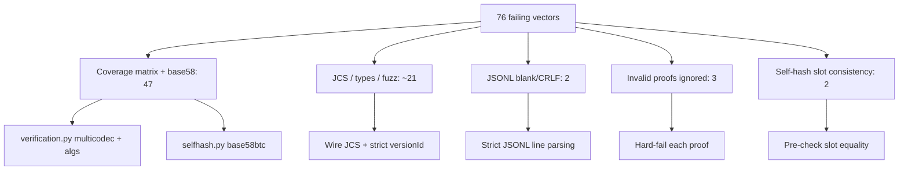

# Fix Python resolver test-vector failures

## Verdict

**All 76 failures are fixable.** OpenSSL/`cryptography` + `jwcrypto` already support Ed448, P-256/384/521, secp256k1, and ES256/ES384/ES512/ES256K. Hash algorithms are already implemented. The only “unimplemented” path today is base58btc self-hash encoding (`z…`), which `multiformats.multibase` already supports — it just needs wiring.

Failures cluster into six root causes:



## 1. Key types / coverage-matrix (45 `matrix-*` + needs correct P-256)

**Cause:** [`_multicodec_to_jwk`](did_webplus/verification.py) treats the first two bytes as a fixed `0xED01`/`0x1200` prefix. Test vectors use **unsigned-varint** multicodec codes + **compressed** SEC1 EC keys. Confirmed: self-hash passes; proof verify returns 0 valid keys.

| Curve | Multicodec | Key bytes | JWS `alg` |
|-------|------------|-----------|-----------|
| Ed25519 | `0xed` | 32 raw | `Ed25519` (alias of EdDSA) |
| Ed448 | `0x1203` | 57 raw | `Ed448` (register like Ed25519) |
| P-256 | `0x1200` | 33 compressed | `ES256` |
| P-384 | `0x1201` | 49 compressed | `ES384` |
| P-521 | `0x1202` | 67 compressed | `ES512` |
| secp256k1 | `0xe7` | 33 compressed | `ES256K` |

**Fix in** [`did_webplus/verification.py`](did_webplus/verification.py):

- Decode kid with `varint` (stream/`BytesIO`), then remaining key material.
- EC: `EllipticCurvePublicKey.from_encoded_point(...)` → JWK `x`/`y`.
- OKP: Ed25519 / Ed448 from raw `x`.
- Mirror the same codes in `_pub_key_to_multicodec_bytes` / `jwk_to_multibase_key` (export compressed EC).
- Allow `Ed448`, `ES256`, `ES384`, `ES512`, `ES256K` in `token.allowed_algs`; register `Ed448` → EdDSA like Ed25519.
- Treat any decode/verify exception as proof failure (see §4).

Proven locally: with correct kid→JWK conversion, all six `matrix-*-sha256` proofs verify.

## 2. Base58btc self-hash (`base-base58btc`, `mixed-base-history`)

**Cause:** [`verify_self_hash`](did_webplus/selfhash.py) raises `"base58btc ('z') self-hash verification not implemented"`. `_parse_hash` also hard-requires prefix `u`.

**Fix in** [`did_webplus/selfhash.py`](did_webplus/selfhash.py):

- Generalize `_parse_hash` / `_encode_hash` / placeholders to use the claimed multibase (`u` or `z`).
- Encode placeholders and computed digests with the **same** multibase as `doc["selfHash"]`.
- `_bytes_to_sign` already calls `_parse_hash(doc["selfHash"])` — once `z` works, mixed-base histories work.

## 3. Wire JCS + strict `versionId` (conformance JCS + fuzz-lite + `data-model-version-id-string`)

**Cause:** Resolver hashes via `json.loads` → re-JCS, so non-canonical wire still verifies. Pydantic coerces `"0"` / `0.0` → `int`.

**Fix:**

- Call existing [`verify_is_canonically_serialized`](did_webplus/selfhash.py) from [`_validate_document`](did_webplus/resolver.py) (and the VDR equivalent in [`vdr.py`](did_webplus/vdr.py)) **before** trusting the doc: `rfc8785.dumps(doc) == wire_line`.
- Reject non-integer `versionId` on the loaded dict: `type(doc["versionId"]) is int` (rejects `str`, `float`, and `bool`). Optionally use Pydantic `StrictInt` in [`document.py`](did_webplus/document.py) as a second line of defense.

This covers: `jcs-extra-whitespace`, `jcs-reordered-fields`, `jcs-non-minimal-number`, `data-model-version-id-string`, and the bulk of fuzz-lite false-accepts.

## 4. JSONL structural (`jsonl-blank-lines`, `jsonl-crlf-line-endings`)

**Cause:** [`resolver.py`](did_webplus/resolver.py) does `split("\n")` + `if ln.strip()` and `line.strip()`, which drops blank lines and eats `\r`.

**Fix:**

- Split on `\n` only; do **not** skip empty lines — empty → resolution error (`malformed-jsonl-line`).
- If any line contains `\r` (or use `splitlines(keepends=True)` and require each record ends with exactly `\n` with no `\r`) → fail.
- Avoid `content.strip()` that can hide a leading blank line; at most drop a single trailing newline after the last record if the HTTP body always ends with `\n`.

Apply the same rules anywhere JSONL is ingested (resolver fetch path; VDR POST/PUT if it accepts multi-line bodies).

## 5. Proofs must all verify (`proofs-mixed-*`, `root-with-invalid-proof`)

**Cause:** [`verify_proofs`](did_webplus/verification.py) soft-skips failed proofs and only checks that remaining valid keys satisfy `updateRules`. Roots with only bad proofs succeed because updateRules are not checked.

**Fix:**

- For each entry in `proofs[]`, cryptographic verify must succeed; on failure raise `VerificationError` (do not continue).
- Still allow multiple *valid* proofs (existing `proofs-extraneous-ignored` stays green).
- Roots: if `proofs` is non-empty, every proof must verify (even though updateRules are not applied).

## 6. Self-hash slot consistency (`self-hash-inconsistent-slots`, `vm-id-self-hash-mismatch`)

**Cause:** [`_replace_self_hash_slots_in_place`](did_webplus/selfhash.py) blanks all slots before hashing, so inconsistent VM `selfHash` query values never affect the digest.

**Fix:** Before replacement, assert every self-hash slot already equals `doc["selfHash"]`:

- Root: DID id path suffix; `selfHash`; each `verificationMethod[].id` and `publicKeyJwk.kid` `selfHash` query param (and path suffix where applicable).
- Non-root: `selfHash` field + VM/kid query `selfHash` params.

Mismatch → `SelfHashError` (`self-hash-slot-mismatch` / `vm-id-selfhash-mismatch`).

## 7. Error mapping (small, keeps CLI/oracle clean)

Ensure `_validate_document` converts `SelfHashError` and chain `ValueError` into `ResolutionError` (today only `VerificationError` is wrapped). Prevents odd CLI exits while still failing resolve.

## Docs

Add a short “Resolver crypto support” note to [`interop/resolver-conformance-testing.md`](interop/resolver-conformance-testing.md) listing supported key types, JWS algs, hash functions, and multibase (`u`/`z`). **No “unsupported” carve-outs** — after this work the matrix should pass.

## Verification

```bash
./interop/run_test_vectors.sh --resolver python
```

Target: **259/259**. Intermediate checks by group: `coverage-matrix`, `conformance`, `jsonl-structural`, `fuzz-lite`, `negative`, `positive`.

Add focused unit tests under `tests/` for: varint+compressed kid decode per curve; `z` self-hash; wire JCS reject; blank/CRLF JSONL; hard-fail invalid proof; inconsistent slots.

## Out of scope

- Unrelated dirty change `RUST_LOG=debug→trace` in [`interop/resolvers.py`](interop/resolvers.py) (revert or leave; not part of this fix).
- Expanding the controller to *create* non-Ed25519 DIDs (resolve-only is enough for these vectors).
