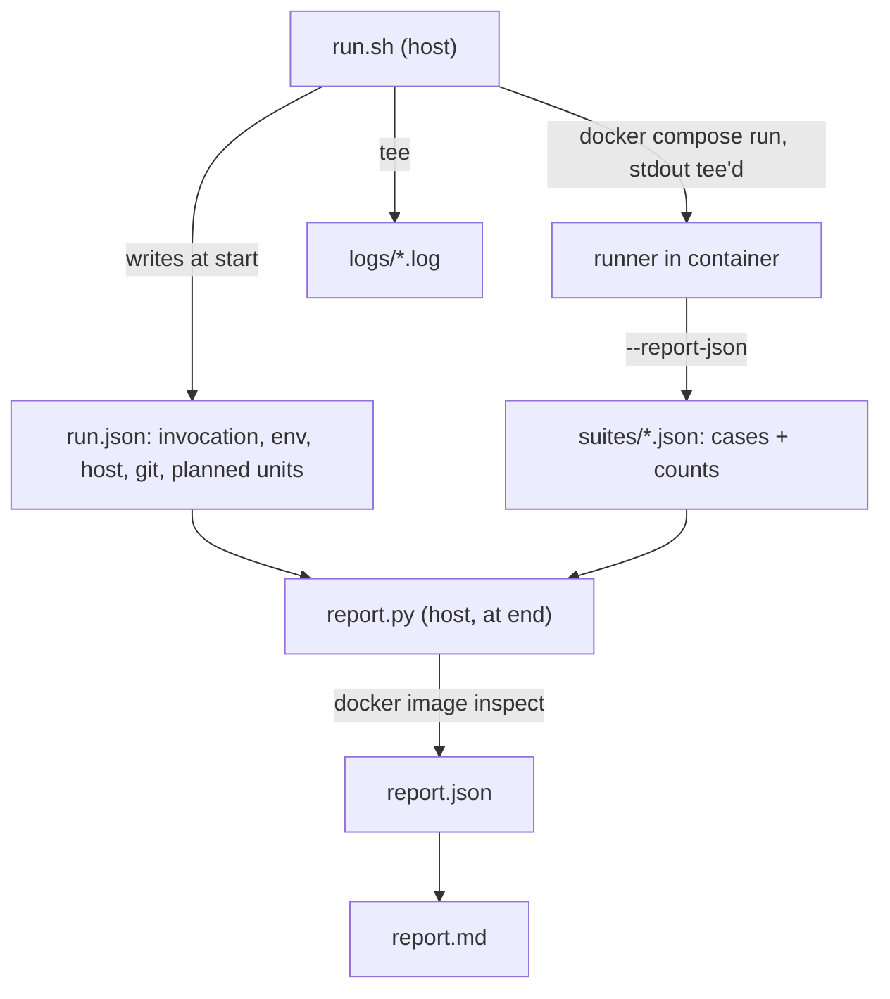

## Goal

Every `./run.sh {matrix|vectors|scenarios|all}` invocation produces `interop/reports/<timestamp>/` containing a self-contained `report.json` plus a rendered `report.md`. Verdicts are **per unit only** (one matrix scenario, or one resolver within one catalog suite) -- no cross-category component aggregation, since a matrix failure cannot be attributed to a single component.

PASS for a unit means all its cases ran and passed. FAIL means a case failed **or** a case that should have run did not, which is why `run.json` records the planned units up front.

## Artifact layout

```
interop/reports/2026-09-19T23.04.12Z/
  run.json                     # written by run.sh at start (invocation, env, host, git, planned units)
  suites/matrix-07.json        # one per runner invocation (matrix-01..22, vectors, scenarios)
  suites/vectors.json
  logs/matrix-07.log           # tee'd stdout/stderr per invocation
  report.json                  # final aggregate, written at end
  report.md                    # rendered from report.json
interop/reports/latest -> 2026-09-19T23.04.12Z
```

Crash robustness: if `report.json` is absent the run died, and `run.json` plus whatever landed in `suites/` shows how far it got. Missing suite artifacts for planned units render as `not-run` -> FAIL.



## Provenance is collected once, on the host

The runner containers mount only `wallets` and `docker.sock`, so they cannot see git. All provenance goes into `run.json` from [interop/run.sh](interop/run.sh); runners report only test results and never probe versions.

- Git: `git rev-parse --short HEAD`, branch, dirty flag from `git status --porcelain`, and catalog submodule SHA via `git -C ledgerdomain.github.io/did-webplus-spec rev-parse HEAD`.
- Zkred pin: reuse the existing `pinned_ts_version()` helper in `run.sh`.
- Host: `uname -m`, `uname -sr`, `nproc`, total memory, `docker --version`, compose version. Arch matters because the Rust images are `platform: linux/amd64`.
- Env whitelist (emit only if set): `INTEROP_ZKRED_DID_WEBPLUS_VERSION`, `TEST_VECTOR_HEALTH_TIMEOUT_SECONDS`, `DID_WEBPLUS_INTEROP_DOCKER_NETWORK`, `INTEROP_ZKRED_LOCAL`, `RUST_VDR_VDG_HOSTS`, `PYTHON_VDR_VDG_HOSTS`, plus verbatim `run.sh` argv.
- Image IDs/digests resolved at report time (images persist; `compose down -v` removes volumes, not images) via `docker image inspect --format '{{.Id}} {{range .RepoDigests}}{{.}}{{end}}'`.

## Component inventory

`report.py` builds a keyed inventory; each case references keys rather than repeating version data. Image refs come from `resolvers.py` constants (`RUST_CLI_IMAGE`, `PYTHON_CLI_IMAGE`, `ZKRED_IMAGE`) and a narrow regex over `image:` lines in [interop/docker-compose.yml](interop/docker-compose.yml) -- no new YAML dependency.

- `controller/python`, `resolver/python`, `vdr/python`: repo SHA + built image ID (`pyproject` version is a static `0.1.0`, useless alone)
- `controller/rust`, `resolver/rust`: `ghcr.io/ledgerdomain/did-webplus-cli:v0.1.5` + digest
- `vdr/rust` (8085), `vdg/rust` (8086): `did-webplus-vdr`/`vdg:v0.1.3` + digest
- `controller/zkred`, `resolver/zkred`: `did-webplus-zkred` image ID + lockfile-pinned `@zkred/did-webplus` version
- `vdr/test-vector-server` (port 80): repo SHA for `test_vector_server.py` + catalog submodule SHA

## Runner changes

Each runner gains `--report-json PATH` and writes its artifact in a `finally` so partial results survive a mid-run abort. Existing stdout output is unchanged.

- [interop/run_test_vectors.py](interop/run_test_vectors.py): add `status` (`pass`/`fail`/`error`/`timeout`) and `unsupported_options` to `CaseResult`, populated from the existing branches in `_run_case` (timeout, `harness error`) and `ResolveResult.unsupported_options`. Keep `unsupported_options` informational rather than a status -- the oracle still evaluates. Record `expected` (number of selected vector x resolver jobs) alongside `executed`. Flag config via `vars(args)`, one line.
- [interop/run_resolution_scenarios.py](interop/run_resolution_scenarios.py): same `status` treatment; record `steps_expected` (`len(meta.steps)`) and `steps_executed` per case so the existing `break` on first failing step reports as incomplete rather than silently omitting steps. Flag config via `vars(args)`.
- [interop/run_interop_tests.py](interop/run_interop_tests.py): accept `--report-json`; emit the scenario axes already computed by `_scenario_params` / `_ts_scenario_params` (controller, VDR, resolver, VDG) so matrix rows are self-describing; add a `_step(msg)` helper that logs the existing `Action: ...` line **and** records a module-level current-step string, so `main()` can report which step failed instead of a bare `FAILED`. It replaces the existing `logger.info("Action: ...")` calls in `run_scenario` and `_run_ts_controller_scenario`, so it adds no new log noise.

## run.sh changes

- Allocate `RUN_ID` (UTC, `%Y-%m-%dT%H.%M.%SZ`) and `INTEROP_REPORT_DIR`; write `run.json`; update the `latest` symlink. No opt-in flag -- always on; print the report path at the end.
- Add `./reports:/app/interop/reports` bind mount to both `interop-runner` and `test-vector-runner` in `docker-compose.yml`.
- `cmd_clean` must not touch `reports/` (note that `run_matrix_scenario` calls `cmd_clean` before *every* scenario).
- Pipe each runner invocation through `tee logs/<suite>.log`; pass `--report-json suites/<suite>.json`. Watch `set -euo pipefail` -- capture the runner exit code, not `tee`'s.
- `cmd_matrix` records the planned scenario list into `run.json` before looping; `run_catalog_suite` records the planned suite so a crash before enumeration still shows as `not-run`.
- Invoke `report.py` at the end of `cmd_matrix`, `cmd_vectors`, `cmd_scenarios`, and `cmd_all` (single point: after the subcommand dispatch, so `all` produces one combined report).

## report.py

New host-side module in `interop/`, no new dependencies.

- Read `run.json` + `suites/*.json`, resolve image IDs, group cases into unit verdicts, write `report.json` (with `schemaVersion`) and render `report.md` from it.
- Unit verdict rows: matrix scenario N, and (suite, resolver) for vectors/scenarios. Each row carries `PASS`/`FAIL`, `passed/expected`, duration, and its repro command (`./run.sh matrix 7`, `./run.sh vectors --resolver python`), env-prefixed when a non-default env var was set.
- Failure detail: assertion `detail` string, the failing matrix step name, and a per-case repro (`./run.sh vectors --resolver python --name <name>`). The exact `docker run` reproducer is already logged by `resolvers.py` into the tee'd suite log, which the report links.
- `report.md` sections: header (timestamps, duration, invocation, git/dirty, host), verdicts, component inventory, failures, logs.

## Doc cleanup (stale manual zkred rebuild)

Already automatic: `run.sh` calls `build_zkred_image` via `build_resolver_images` on every matrix scenario and catalog suite, and `Dockerfile.zkred` copies `package.json`/`package-lock.json` before `npm ci`, so a lockfile bump invalidates the layer.

- [interop/README.md](interop/README.md): drop step 5 ("Rebuild the zkred Docker image") from the bump workflow; rewrite the "When rebuild is required" blockquote, which contradicts itself by also saying `./run.sh` rebuilds automatically. Keep the read-only "check which version will run" commands.
- [interop/ZKRED_VERSION.md](interop/ZKRED_VERSION.md): remove the `# Rebuild runner image` / `docker build` lines.
- [interop/README.md](interop/README.md): add a short "Run reports" section documenting the artifact layout and verdict semantics.
- [.gitignore](.gitignore): add `interop/reports/` (`*.log` is already ignored globally, but the whole tree should be).
