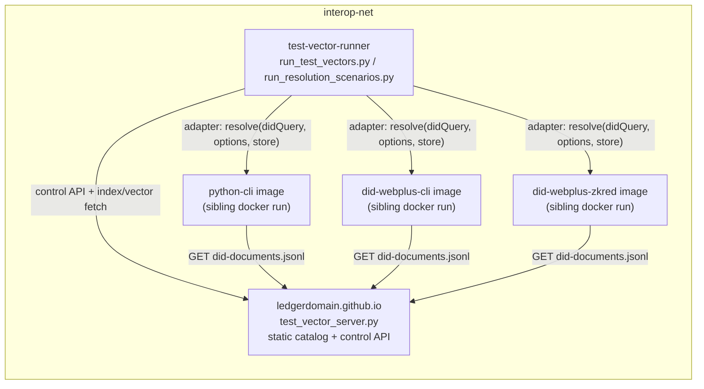

# Resolution-Scenario Conformance Suite

## Context

The updated catalog (submodule `interop/ledgerdomain.github.io/did-webplus-spec/test-vector`, index format `did-webplus-test-vector-index/2`) adds 16 `resolution-scenario` vectors, each with a `resolution-scenario.json` (format `did-webplus-resolution-scenario/1`). Conformance requires a live VDR whose served `did-documents.jsonl` can be truncated per step and whose GET counts can be read — impossible on the current static RangeHTTPServer. Per the reference doc (`did-webplus/did-webplus/test-vector/README.md` in the Rust repo), the harness loop per step is: reset control state, set serve-count, resolve `didQuery` with `resolutionOptions` against a persistent per-scenario store, assert normative expectations, assert `vdrRequestCount`.

Decisions already made:
- One service serves both the existing static catalog and the new control functionality (we own it; no dependency on the unpublished Rust `did-webplus-test-vector serve`).
- Serving the pinned submodule files verbatim means DIDs/timestamps match exactly; no regeneration/determinism concerns.
- Resolver implementation gaps (Python metadata fields, Zkred persistence) are findings to report, not blockers.
- Scenarios run sequentially (control reset is global); the existing parallel non-scenario suite is untouched.

Architectural simplifications folded into this work (in support of the eventual split of `interop/` into its own repo, which should be implementation-agnostic):
- The Python resolver becomes a docker image invoked like Rust/Zkred, removing the harness's in-process dependency on the parent `did_webplus` package for resolution.
- One resolver-adapter layer serves all three suites (matrix, vectors, scenarios).
- One shell entry point replaces the growing set of per-suite scripts.

## 1. Catalog server with control API

New `interop/test_vector_server.py`, replacing RangeHTTPServer inside [interop/Dockerfile.test-vector-server](interop/Dockerfile.test-vector-server) (same service name `ledgerdomain.github.io`, port 80, `interop-net` alias, same volume mount — compose changes minimal). Stdlib `http.server` is sufficient, with the caveat that stdlib has no built-in Range support (that is what the current `rangehttpserver` pip dependency provided): we hand-roll Range handling on `BaseHTTPRequestHandler`, which is required anyway because ranges must be computed against the serve-count-truncated *effective* length, not the on-disk file size — no off-the-shelf static server can do that. Only single ranges (`bytes=start-` / `bytes=start-end`) need support; the resolvers' incremental fetches use nothing else (multipart/suffix ranges may be answered with a full 200, which is RFC-legal). Use `ThreadingHTTPServer` with a `threading.Lock` around the serve-count/counter state since control mutations and resolver GETs interleave. The `rangehttpserver` pip install is dropped; the image becomes dependency-free.

Behavior:
- Serve all files under the mounted `test-vector/` tree as today (`index.json`, `test-vector.json`, `resolution-scenario.json`, `did-documents.jsonl`).
- `GET /health` for the existing compose healthcheck.
- Per-vector serve-count state for `did-documents.jsonl`: effective body = first N lines (byte offsets computed by scanning newlines, cached per file). Default: all lines.
- Range semantics against the *effective* length: `206` with correct `Content-Range` for satisfiable ranges; `416` with `Content-Range: bytes */<effectiveLength>` when the requested range starts at or past the effective length ("client already up to date").
- Request counters: count every GET of `{path}/did-documents.jsonl`.
- Control API (paths are the `path` field from `index.json`, no leading slash, no filename):
  - `PUT /control/serve-count` body `{"path": ..., "servedDidDocumentCount": N}` → `{path, servedDidDocumentCount, servedOctetLength}`
  - `GET /control/request-count?path=...` → `{path, requestCount}`
  - `POST /control/reset` → `204` (all serve-counts to full, all counters to zero)

Verification: the existing vector suite (`./run_test_vectors.sh`, later `./run.sh vectors`) must stay green against the new server (full-serve default makes it a drop-in static server).

## 2. Containerized Python resolver

New `interop/Dockerfile.python-cli`: image bundling the `did-webplus` CLI from this repo (same base approach as [interop/Dockerfile.python-vdr](interop/Dockerfile.python-vdr)), built on demand by the entry-point script like the zkred image. The adapter invokes it as a sibling `docker run --network $DID_WEBPLUS_INTEROP_DOCKER_NETWORK` container with a per-scenario temp dir mounted as `--base-dir`, exactly symmetric with the Rust and Zkred adapters. This removes the `uv run did-webplus ... cwd=repo-root` coupling in [interop/resolvers.py](interop/resolvers.py) for resolution. (The matrix runner's Python *controller* calls in `run_interop_tests.py` — `did create`/`update`/`deactivate` — can adopt the same image later; out of scope here.)

## 3. Unified resolver adapter layer with options + persistent store

Restructure [interop/resolvers.py](interop/resolvers.py) from three free functions with divergent signatures into one adapter interface used by all three suites (matrix resolver calls at `run_interop_tests.py` lines ~472/522, `run_test_vectors.py`, and the new scenario runner):

- `resolve(did_query, *, options, store_dir, vdg_url, timeout) -> ResolveResult` where `ResolveResult` carries the parsed triple (`didDocument`, `didDocumentMetadata`, `didResolutionMetadata`), exit status, and raw output — replacing per-caller stdout parsing (today `run_test_vectors.py` extracts only `didDocument`).
- A per-adapter declarative mapping from wire options (`requestCreate`, `requestNext`, `requestLatest`, `requestDeactivated`, `localResolutionOnly`) to CLI flags. Options an implementation cannot express are recorded in the result detail (the resolve still runs; assertions then fail and we report it). This mapping doubles as the option-support documentation we communicate to implementors.
  - Python: `resolve <didQuery> -o json --base-dir <store>`; `localResolutionOnly` → `--no-fetch`; the four `request*` options have no flags yet (expected finding).
  - Rust: pinned `ghcr.io/ledgerdomain/did-webplus-cli` with a per-scenario host temp dir mounted as the doc-store, plus `-C/-N/-L/-D/-l` style flags. First implementation step: capture `did resolve --help` from the pinned image to fix exact flag and store-path argument names (options confirmed to exist in the published image; bump the pinned tag if needed).
  - Zkred: `ts_runner.mjs resolve` per step as-is. No persistence between process runs is an expected finding. Only if `ts_runner.mjs` trivially supports a keep-alive/multi-command mode do we use it; otherwise do not build one.

Migrating `run_interop_tests.py` to the adapters is a mechanical swap of its three resolver call sites plus its own output parsing; verify with a couple of matrix scenarios (e.g. 1 and 17).

## 4. Scenario runner

New `interop/run_resolution_scenarios.py` (separate from `run_test_vectors.py`; shares `resolvers.py` and the index-fetch helpers):

- Fetch `index.json`; select `groups["resolution-scenario"]` (support `--name` / `--resolver` filters like the existing runner).
- Per (vector, resolver), sequentially:
  1. Fresh empty store (temp dir) at scenario start; retained across steps.
  2. Fetch `{path}/resolution-scenario.json`; validate format string.
  3. Per step: `POST /control/reset`; `PUT /control/serve-count` with `servedDidDocumentCount`; resolve `didQuery` with mapped `resolutionOptions`; assert; `GET /control/request-count` and assert equals `vdrRequestCount`.
- Normative assertions only:
  - `success` / failure
  - on success: `didDocumentVersionId`, `didDocumentSelfHash`, exact `didDocumentMetadata` JSON equality
  - the three resolution-metadata booleans (`fetchedUpdatesFromVDR`, `didDocumentResolvedLocally`, `didDocumentMetadataResolvedLocally`)
  - on failure: `didResolutionMetadata.error` present
  - `contentType` and error text are advisory (log only)
- Report in the existing style: per-resolver totals, per-scenario step-level failure details, non-zero exit on any failure. Failures are expected for Python/Zkred initially; the report is the deliverable.

## 5. Single entry point

New `interop/run.sh` with subcommands, replacing the per-suite scripts (the compose-lifecycle logic — build images, start services, wait for health, `docker compose run` the runner, tear down — is the same shape in each):

- `./run.sh matrix [N]` — replaces `run_interop_tests.sh` / `run_all_interop_tests.sh`
- `./run.sh vectors [filters...]` — replaces `run_test_vectors.sh` (passes `--group` / `--name` / `--resolver` etc. through to `run_test_vectors.py`)
- `./run.sh scenarios [filters...]` — new; `docker compose run --rm test-vector-runner` with the scenario runner as the command override
- `./run.sh all` — matrix + vectors + scenarios
- `./run.sh clean` — replaces `stop_and_clean.sh`

Delete the old scripts and update every reference (both READMEs, including the reproducibility section in [interop/README.md](interop/README.md)).

## 6. Docs

Update [interop/resolver-conformance-testing.md](interop/resolver-conformance-testing.md) (server capabilities, control API, scenario oracle, sequential-execution note, how to run) and [interop/README.md](interop/README.md) (new entry point, adapter/image architecture, pointer to scenario suite).

## Out of scope

- Python resolver feature work (request options, `*Milliseconds` metadata, key casing).
- Migrating the matrix runner's Python controller calls to the python-cli image (follow-up toward the repo split).
- Zkred keep-alive architecture unless trivially available.
- Parallel scenario execution / per-scenario counter diffing (revisit later; noted in doc).
- Asserting Range-based incremental fetch beyond `vdrRequestCount` (unassertable by design for now).
- A declarative implementations manifest (name, image, command template, option map) — deferred until a fourth implementation shows up; the adapter option-mapping introduced here is the seed for it.