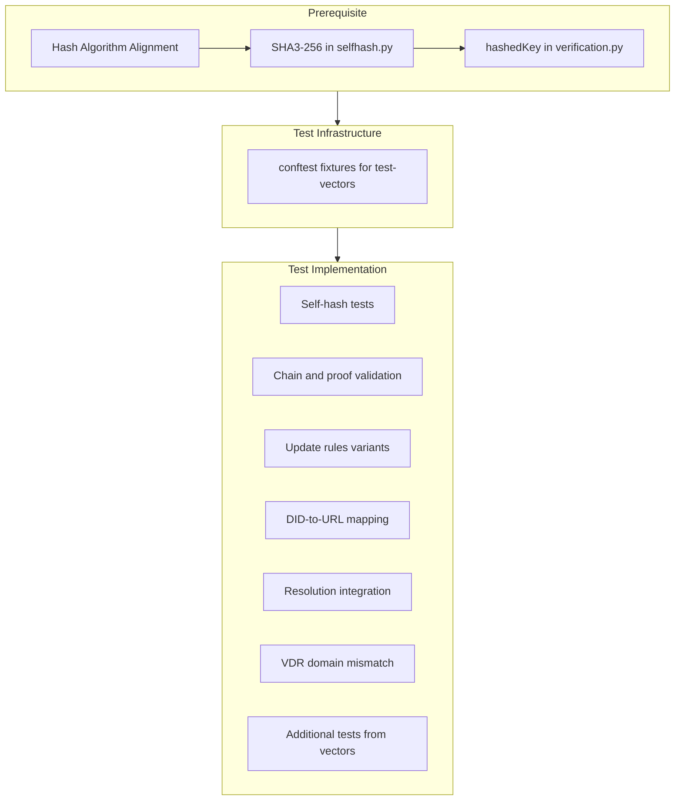

# Test Vector Evaluation and Implementation Plan

## Part 1: Evaluate Test Vector Appropriateness

### 1.1 Coverage vs. Requested Vectors ([docs/TEST_VECTOR_REQUESTS.md](docs/TEST_VECTOR_REQUESTS.md))

| Requested                                                      | Provided                                                                    | Status  |
| -------------------------------------------------------------- | --------------------------------------------------------------------------- | ------- |
| Canonical root + non-root (JCS, selfHash, updateRules, proofs) | `valid/root-document.json`, `valid/non-root-document.json`, `.jcs` variants | **Met** |
| Microledger (2+ docs, DID, resolution URL)                     | `microledgers/example-did/` with 2 docs                                     | **Met** |
| Invalid self-hash                                              | `negative/invalid-self-hash.json` (root doc with wrong selfHash)            | **Met** |
| Invalid chain                                                  | `negative/invalid-chain.json` (prevDIDDocumentSelfHash mismatch)            | **Met** |
| Invalid versionId                                              | `negative/invalid-version-id.json` (versionId=3 instead of 2)               | **Met** |
| Invalid validFrom                                              | `negative/invalid-valid-from.json` (validFrom <= prev)                      | **Met** |
| Invalid proofs                                                 | `negative/invalid-proofs.json` (bad JWS kid/signature)                      | **Met** |
| Unsatisfied update rules                                       | `negative/unsatisfied-update-rules.json` (proof from wrong key)             | **Met** |
| Malformed update rules                                         | `negative/malformed-update-rules.json` (`key: 123`)                         | **Met** |
| Resolution expectations                                        | `resolution-expectations/example-did/` (plain, versionId, selfHash)         | **Met** |
| Update rules variants                                          | `update-rules-variants/` (key, hashedKey, any, all, atLeast, key-base58btc) | **Met** |
| DID-to-URL mapping                                             | `did-to-url-mapping/mapping.json` (4 cases)                                 | **Met** |
| VDR domain mismatch                                            | `negative/invalid-vdr-domain-mismatch.json`                                 | **Met** |

**Optional items:** Deactivated DID, path components, port — not provided; acceptable for initial pass.

### 1.2 Hash Algorithm Requirements (Spec Compliance)

The did:webplus spec **requires support for all of the following hash functions**: BLAKE3, SHA-224, SHA-256, SHA-384, SHA-512, SHA3-224, SHA3-256, SHA3-384, and SHA3-512.

| Algorithm | Digest Size | Multicodec (for detection) |
| --------- | ----------- | -------------------------- |
| BLAKE3    | 256 bits    | (existing `u` + base64url) |
| SHA-224   | 224 bits    | multicodec 0x1013          |
| SHA-256   | 256 bits    | multicodec 0x12            |
| SHA-384   | 384 bits    | multicodec 0x20            |
| SHA-512   | 512 bits    | multicodec 0x13            |
| SHA3-224  | 224 bits    | multicodec 0x17            |
| SHA3-256  | 256 bits    | multicodec 0x16            |
| SHA3-384  | 384 bits    | multicodec 0x21            |
| SHA3-512  | 512 bits    | multicodec 0x14            |

The Python implementation currently supports **only BLAKE3** ([did_webplus/selfhash.py](did_webplus/selfhash.py), [did_webplus/verification.py](did_webplus/verification.py)).

The test vectors use **SHA3-256** (e.g. `uFiC9wGOLc7j0fWE3D-0rH5hQooYOWpDdmBBcCI_aKEvlnw`), so they will not verify with the current code.

**Action**: Implement all 9 hash algorithms with multicodec-based detection. Both self-hash and hashedKey (update rules) must use the algorithm indicated by the hash string's multicodec prefix.

### 1.3 Other Evaluation Notes

- **JCS**: Test vectors use RFC 8785; Python uses `rfc8785` — compatible.
- **JWS proofs**: Detached payload, `b64: false`, `kid` = base64url multicodec public key — matches [verification.py](did_webplus/verification.py).
- **Resolution metadata**: Test expectations include `createdMilliseconds`, `updatedMilliseconds`, `nextUpdateMilliseconds`, `nextVersionId`; Python resolver does not emit these. Either extend resolver output or relax test expectations.
- **key-base58btc**: Test vectors include `did-to-url-mapping` and `key-base58btc`; Python verification currently expects base64url for `key` — base58btc support may need to be added for full compliance.

---

## Part 2: Implementation Plan

### Phase A: Hash Algorithm Alignment (prerequisite)

1. **Implement all 9 hash algorithms** in [did_webplus/selfhash.py](did_webplus/selfhash.py):
  - BLAKE3, SHA-224, SHA-256, SHA-384, SHA-512, SHA3-224, SHA3-256, SHA3-384, SHA3-512.
  - Detect algorithm from multicodec prefix (base64url decode, parse varint).
  - Define placeholder for each algorithm (multicodec + zero digest).
  - Use `hashlib` for SHA-224/256/384/512, `hashlib.sha3_*` for SHA3-*, `blake3` for BLAKE3.
2. **Update [did_webplus/verification.py](did_webplus/verification.py) for `hashedKey`: Use the same multicodec-based algorithm detection for key hashing.’s

**Action**: Implement all 9 hash algorithms with multicodec-based detection. Both self-hash and hashedKey (update rules) must use the algorithm indicated by the hash string's multicodec prefix.

### 1.3 Other Evaluation Notes

- **JCS**: Test vectors use RFC 8785; Python uses `rfc8785` — compatible.
- **JWS proofs**: Detached payload, `b64: false`, `kid` = base64url multicodec public key — matches [verification.py](did_webplus/verification.py).
- **Resolution metadata**: Test expectations include `createdMilliseconds`, `updatedMilliseconds`, `nextUpdateMilliseconds`, `nextVersionId`; Python resolver does not emit these. Either extend resolver output or relax test expectations.
- **key-base58btc**: Test vectors include `did-to-url-mapping` and `key-base58btc`; Python verification currently expects base64url for `key` — base58btc support may need to be added for full compliance.

---

## Part 2: Implementation Plan

### Phase A: Hash Algorithm Alignment (prerequisite)

1. (Consolidated above) Confirm did:webplus spec’s hash algorithm(s) for selfHash and hashedKey.
2. **Implement SHA3-256** in [did_webplus/selfhash.py](did_webplus/selfhash.py):
  - Detect hash algorithm from multicodec prefix (e.g. `uFi` for SHA3-256).
  - Add SHA3-256 computation path alongside or replacing BLAKE3.
  - Ensure placeholder handling for SHA3-256.
3. **Update [did_webplus/verification.py](did_webplus/verification.py) for `hashedKey`:
  - Use the same algorithm as selfHash (or spec-defined MBHash) for key hashing.

### Phase B: Test Infrastructure

1. **Add test vector fixtures** in [tests/conftest.py](tests/conftest.py):
  - `TEST_VECTORS_DIR = Path(__file__).resolve().parent.parent / "test-vectors"`
  - Fixtures: `test_vector_root_jcs`, `test_vector_non_root_jcs`, `test_vector_microledger`, `test_vector_negative_cases`, `test_vector_resolution_expectations`, `test_vector_did_mapping`.
2. **Optional**: Copy or symlink `test-vectors/` into `tests/fixtures/test-vectors/` for a single source of truth, or reference from project root.

### Phase C: Self-Hash Tests ([tests/test_selfhash.py](tests/test_selfhash.py))

| Test                                          | Source                          | Description                                  |
| --------------------------------------------- | ------------------------------- | -------------------------------------------- |
| `test_verify_accepts_valid_root_document`     | valid/root-document.jcs         | `verify_self_hash` returns claimed hash      |
| `test_verify_accepts_valid_non_root_document` | valid/non-root-document.jcs     | Same for non-root                            |
| `test_verify_rejects_invalid_self_hash`       | negative/invalid-self-hash.json | JCS form with wrong selfHash → SelfHashError |

(Existing tests for placeholder, missing selfHash, tampered hash remain.)

### Phase D: Chain and Proof Validation Tests

Create [tests/test_verification.py](tests/test_verification.py) or extend [tests/test_resolver_integration.py](tests/test_resolver_integration.py):

| Test                                             | Source                                 | Description                      |
| ------------------------------------------------ | -------------------------------------- | -------------------------------- |
| `test_validate_document_accepts_valid_chain`     | microledgers/example-did               | Full chain validates             |
| `test_validate_rejects_invalid_chain`            | negative/invalid-chain.json            | prevDIDDocumentSelfHash mismatch |
| `test_validate_rejects_invalid_version_id`       | negative/invalid-version-id.json       | versionId != prev + 1            |
| `test_validate_rejects_invalid_valid_from`       | negative/invalid-valid-from.json       | validFrom <= prev                |
| `test_validate_rejects_invalid_proofs`           | negative/invalid-proofs.json           | JWS verification fails           |
| `test_validate_rejects_unsatisfied_update_rules` | negative/unsatisfied-update-rules.json | Proof key doesn’t match rules    |
| `test_validate_rejects_malformed_update_rules`   | negative/malformed-update-rules.json   | Invalid updateRules structure    |

### Phase E: Update Rules Variant Tests

| Test                              | Source                                   | Description                            |
| --------------------------------- | ---------------------------------------- | -------------------------------------- |
| `test_update_rules_key`           | update-rules-variants/key.json           | `key` rule satisfied by matching proof |
| `test_update_rules_hashed_key`    | update-rules-variants/hashed-key.json    | hashedKey rule                         |
| `test_update_rules_any`           | update-rules-variants/any.json           | any-of rules                           |
| `test_update_rules_all`           | update-rules-variants/all.json           | all-of rules                           |
| `test_update_rules_at_least`      | update-rules-variants/at-least.json      | atLeast/weight rules                   |
| `test_update_rules_key_base58btc` | update-rules-variants/key-base58btc.json | base58btc key (if implemented)         |

These can be parametrized over the variant files.

### Phase F: DID-to-URL Mapping Tests

Create [tests/test_did.py](tests/test_did.py) or extend existing DID tests:

| Test                         | Source                          | Description                   |
| ---------------------------- | ------------------------------- | ----------------------------- |
| `test_did_to_resolution_url` | did-to-url-mapping/mapping.json | Each DID maps to expected URL |

Parametrize over the 4 mapping entries (example.com, localhost, path, port).

### Phase G: Resolution Integration Tests

Replace or supplement ledgerdomain fixture tests with test-vector-based tests:

| Test                                       | Source                                           | Description                                     |
| ------------------------------------------ | ------------------------------------------------ | ----------------------------------------------- |
| `test_resolve_example_did_plain`           | microledgers + resolution-expectations/plain-did | Resolve latest, assert didDocument and metadata |
| `test_resolve_example_did_with_version_id` | resolution-expectations/with-version-id          | `?versionId=0` returns root                     |
| `test_resolve_example_did_with_self_hash`  | resolution-expectations/with-self-hash           | `?selfHash=...` returns matching doc            |

**Metadata alignment**: Resolution expectations use `createdMilliseconds`, `updatedMilliseconds`, `nextUpdateMilliseconds`, `nextVersionId`. Options:

- Extend [did_webplus/resolver.py](did_webplus/resolver.py) to emit these (with camelCase JSON keys), or
- Normalize expectations in tests (e.g. compare only `created`, `updated`, `versionId`, `nextUpdate`, `deactivated`).

### Phase H: VDR Domain Mismatch

| Test                       | Source                                    | Description                                                                                                                                                             |
| -------------------------- | ----------------------------------------- | ----------------------------------------------------------------------------------------------------------------------------------------------------------------------- |
| `test_vdr_domain_mismatch` | negative/invalid-vdr-domain-mismatch.json | Document `id` has `wrong.example.com` while content references `example.com` — define expected behavior (reject at resolution? document validation?) and implement test |

### Phase I: Unblock Ledgerdomain Fixture Tests

- Remove or adjust `@pytest.mark.skip` on `test_ledgerdomain_fixture_chain_validation` once hash alignment is done.
- Ledgerdomain fixtures may still use a different hash (BLAKE3 vs SHA3-256); handle via algorithm detection or keep skipped if they use a different format.

---

## Part 3: Tests Suggested by Test Vectors (Not Previously Planned)

1. **JCS canonical form**: Assert that `valid/*.jcs` equals `rfc8785.dumps(json.loads(...))` to ensure JCS round-trip.
2. **Microledger ordering**: Assert documents in `did-documents.jsonl` have correct `versionId` sequence (0, 1, ...).
3. **Resolution URL from DID**: Use `did.txt` and `resolution-url.txt` to validate `did_to_resolution_url()`.
4. **Parametrized negative tests**: Single parametrized test over all `negative/*.json` files with expected error type (SelfHashError, VerificationError, ResolutionError, ValueError).

---

## Summary Diagram

---

## File Change Summary

| File                                                                     | Changes                                                         |
| ------------------------------------------------------------------------ | --------------------------------------------------------------- |
| [did_webplus/selfhash.py](did_webplus/selfhash.py)                       | Add SHA3-256 support, multicodec detection                      |
| [did_webplus/verification.py](did_webplus/verification.py)               | Align hashedKey with spec (SHA3-256 or as specified)            |
| [tests/conftest.py](tests/conftest.py)                                   | Add test-vector fixtures                                        |
| [tests/test_selfhash.py](tests/test_selfhash.py)                         | Add valid/invalid vector tests                                  |
| [tests/test_verification.py](tests/test_verification.py)                 | New: chain, proof, update-rules tests                           |
| [tests/test_did.py](tests/test_did.py)                                   | New or extend: DID-to-URL mapping tests                         |
| [tests/test_resolver_integration.py](tests/test_resolver_integration.py) | Add test-vector resolution tests, possibly unblock ledgerdomain |
| [did_webplus/resolver.py](did_webplus/resolver.py)                       | Optional: extend metadata for resolution expectations           |

