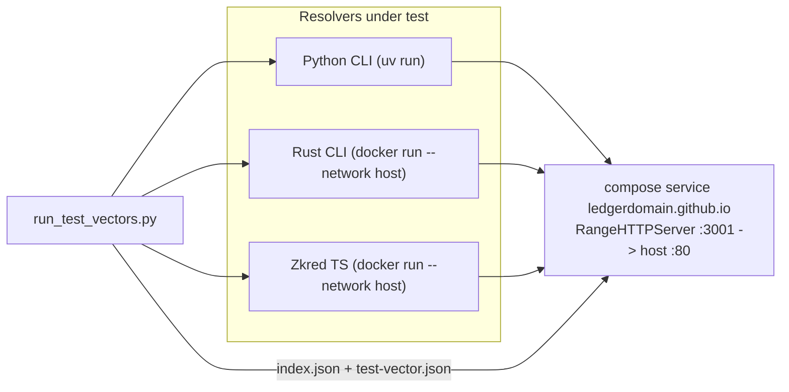

# Test-vector interop suite

## What the catalog looks like today

`interop/ledgerdomain.github.io/did-webplus-spec/test-vector` is a symlink to the sibling checkout `/home/vdods/files/github/LedgerDomain/did-webplus-spec/test-vector`, and `interop/ledgerdomain.github.io/` is currently untracked. Facts that drive the design:

- 251 vectors, all with host `ledgerdomain.github.io` and **no port**, e.g. `did:webplus:ledgerdomain.github.io:did-webplus-spec:test-vector:uFiA_9Yu...`
- Groups: `positive` 78, `negative` 173; categories `conformance` 52, `coverage-matrix` 59, `fuzz-lite` 128, `jsonl-structural` 6, `stress` 6
- Max catalog path depth 32 (`path0000/.../path0031/<rootSelfHash>`); also `teams/identity/alice/<rootSelfHash>`
- Largest microledger is `stress-many-versions-1000` at 3.9 MB / 1000 documents (needs a resolve timeout well above the current 15 s)
- Exactly one vector has `didDocumentCount: 0` (`jsonl-empty-file`, `valid: true`) — needs an explicit special case

Because the DIDs carry no port, the resolution URL is `http://ledgerdomain.github.io/did-webplus-spec/test-vector/<rootSelfHash>/did-documents.jsonl` on **port 80**.

## Architecture



Name resolution: `/etc/hosts` maps `ledgerdomain.github.io` to `127.0.0.1`, same pattern already used for `rust-vdr` / `rust-vdg` / `python-vdr`. Scheme: `ledgerdomain.github.io=http` added to `DID_WEBPLUS_HTTP_SCHEME_OVERRIDE` (the TS runner already hardcodes `{ scheme: "http" }` in [interop/ts_runner.mjs](interop/ts_runner.mjs)).

## 1. Static server service

New `interop/Dockerfile.test-vector-server`:

```dockerfile
FROM python:3.12-slim
RUN pip install --no-cache-dir rangehttpserver
WORKDIR /srv
EXPOSE 3001
CMD ["python3", "-m", "RangeHTTPServer", "3001"]
```

New service in [interop/docker-compose.yml](interop/docker-compose.yml):

```yaml
  ledgerdomain.github.io:
    build:
      context: .
      dockerfile: Dockerfile.test-vector-server
    volumes:
      - ./ledgerdomain.github.io/did-webplus-spec/test-vector:/srv/did-webplus-spec/test-vector:ro
    ports:
      - "80:3001"
    healthcheck:
      test: ["CMD", "python3", "-c", "import urllib.request; urllib.request.urlopen('http://localhost:3001/did-webplus-spec/test-vector/index.json').read(1)"]
      start_period: 5s
      interval: 3s
      timeout: 3s
      retries: 5
```

Two details that are easy to get wrong:

- Mount the **symlink path itself**, not its parent. Bind-mounting `./ledgerdomain.github.io` would copy the symlink into the container where its `../../../../` target does not exist; mounting the symlink path makes Docker resolve it host-side.
- `"80:3001"` is required, not cosmetic: the DIDs have no port, so resolvers will request port 80. Docker publishes privileged ports fine since the daemon is root.

## 2. Runner

New [interop/run_test_vectors.py](interop/run_test_vectors.py) and a thin [interop/run_test_vectors.sh](interop/run_test_vectors.sh) (compose up the one service, stream logs, run the Python runner, `compose down` on exit — mirroring [interop/run_interop_tests.sh](interop/run_interop_tests.sh)).

Runner flags: `--resolver python|rust|zkred|all` (default `all`), `--group NAME` (repeatable), `--name NAME` (repeatable), `--jobs N` (default 8), `--catalog-url` (default `http://ledgerdomain.github.io/did-webplus-spec/test-vector`), `--timeout` (default 60 s).

Flow, per the implementor guide:

1. `GET <catalog>/index.json`, assert `format == "did-webplus-test-vector-index/2"`. Fetching over HTTP (not from disk) also validates the hosting.
2. Select vector names from `--group` / `--name`, else all 251.
3. Per vector: `GET <catalog>/<path>/test-vector.json`, assert `format == "did-webplus-test-vector/1"`, cross-check `did` against the index entry.
4. Run each selected resolver on `metadata.did`, evaluate the oracle, record PASS/FAIL.

### Oracle for the resolution path

`n = didDocumentCount`, `k = expected.validDidDocumentCount`, `valid = expected.valid`. Resolvers only expose "resolve latest", so the boundary collapses to:

- `n == 0` (only `jsonl-empty-file`): resolve must **fail** — nothing exists to resolve. Special-cased ahead of the `valid` check, since this vector is `valid: true`.
- `valid == true`, `n > 0`: resolve must **succeed** and the returned document's `versionId` must equal `n - 1`.
- `valid == false`: resolve must **fail**. A successful resolve is a failure even when the resolver returns the valid prefix's latest document (the guide forbids silently accepting a truncated chain).

`errorCode` and `errorVersionId` are logged on failure for diagnostics but never gate the result. `k` is advisory in this mode; see the follow-up note below.

### Execution details

- Reuse the existing resolver invocations by extracting `_run_python_resolve`, `_run_rust_resolve`, `_run_zkred_resolve` and `HTTP_SCHEME_OVERRIDE` from [interop/run_interop_tests.py](interop/run_interop_tests.py) into a shared `interop/resolvers.py`, adding `base_dir` and `timeout` parameters. Both runners then share one code path.
- Give the Python resolver a **per-vector temp `--base-dir`** so its SQLite store cannot carry state between vectors or contend under parallelism. Rust and TS run with `docker run --rm` and are already isolated.
- Parallelize with `concurrent.futures.ThreadPoolExecutor(--jobs)`. At 251 vectors x 3 resolvers that is ~750 process spawns; 8 workers keeps a full run in the low minutes. If that proves too slow, the follow-up is one long-lived container per resolver kind plus `docker exec` per vector.
- Output: per-vector `PASS`/`FAIL` lines, then a summary broken down by resolver and group, with a list of failures. Exit non-zero if any vector fails.

## 3. Docs and cleanup

- [interop/README.md](interop/README.md): add `127.0.0.1  ledgerdomain.github.io` to the hosts-file section, document the new service and runner, and state the caveat plainly — while that hosts entry is present it shadows the real spec site machine-wide, so `https://ledgerdomain.github.io` and [scripts/fetch_ledgerdomain_fixtures.py](scripts/fetch_ledgerdomain_fixtures.py) will fail until it is commented out.
- [interop/stop_and_clean.sh](interop/stop_and_clean.sh) already does `docker compose down -v`, which covers the new service; verify no extra cleanup is needed.
- Decide `.gitignore` treatment for `interop/ledgerdomain.github.io/` while it remains a symlink to a sibling checkout (a committed symlink pointing outside the repo would dangle for other clones). This is resolved properly by the sync step below.

## 4. DO NOT DO THIS YET — vector sync script (next step)

Deferred entirely to a follow-up task; do not implement as part of this plan.

- `scripts/sync_test_vectors.sh`: download a pinned commit archive of the spec repo (`https://github.com/LedgerDomain/<repo>/archive/<sha>.tar.gz`), extract only `did-webplus-spec/test-vector/**` into `interop/ledgerdomain.github.io/did-webplus-spec/test-vector/`, replacing the developer-local symlink with vendored content committed to this repo.
- `interop/TEST_VECTORS_VERSION.md`: pin card mirroring [interop/ZKRED_VERSION.md](interop/ZKRED_VERSION.md) — pinned SHA, source URL, sync date, bump instructions.
- Bumps happen by running the script and committing the diff; no submodule, no floating `latest`.

## Follow-up worth noting (not in scope)

The guide's normative oracle is the exact accepted-prefix length `k`, which "resolve latest" cannot observe — 52 negative vectors have `k > 0` and are only checked as "must fail" here. A Python-only, in-process check that feeds the JSONL through the validator and asserts the exact boundary would cover that, and belongs in `tests/` rather than the interop harness.