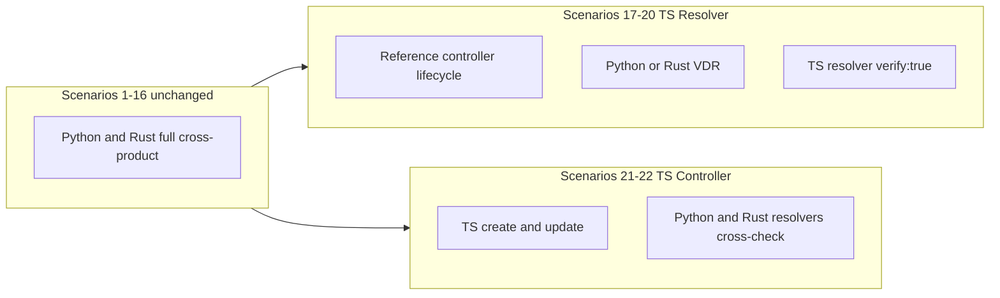

# TS/JS did:webplus Interop Integration Plan

## Context

The third-party implementation is [`@zkred/did-webplus`](https://github.com/Zkred/did-methods/tree/main/packages/did-webplus) (npm v0.4.0, Node >= 20). It is a **library**, not a CLI — interop must invoke it via a small Node runner.

### What it implements (testable)

| Component | Status | Interop role |
|-----------|--------|--------------|
| **Resolver** | Yes — `resolve()` / `getResolver({ verify: true, vdg })` | Test in scenarios 17–20 |
| **Controller** | Partial — `createDidDocument` + `registerDid`, `updateDidDocument` + `submitDidUpdate` | Test in scenarios 21–22 |
| **VDG client** | Yes — resolver `vdg` option | Covered in VDG=yes resolver scenarios |
| **VDR / VDG server** | No | Continue using Python/Rust Docker services |
| **Deactivate** | No exported helper | **Out of scope** for TS controller scenarios |

The existing 16 scenarios in [`interop/run_interop_tests.py`](interop/run_interop_tests.py) remain unchanged in behavior and numbering.

---

## Test strategy: tiered coverage (not 3-way combinatorics)

A full 3-implementation matrix on 4 axes would be ~48–81 scenarios. Instead, use **role-targeted scenarios**: TS is only varied in axes where it has an implementation; reference implementations (Python/Rust) handle everything else.



### New scenarios 17–22

| # | TS role | Controller | VDR | Resolver under test | VDG | Lifecycle tested |
|---|---------|------------|-----|---------------------|-----|------------------|
| 17 | Resolver | Python | Python | **TS** | no | Full (create → v0 → update → v1 → deactivate → v2) |
| 18 | Resolver | Python | Python | **TS** | yes | Full + VDG header checks |
| 19 | Resolver | Rust | Rust | **TS** | no | Full |
| 20 | Resolver | Rust | Rust | **TS** | yes | Full + VDG header checks |
| 21 | Controller | **TS** | Python | Python **and** Rust (same scenario) | no | Create + update only (v0, v1) |
| 22 | Controller | **TS** | Rust | Python **and** Rust (same scenario) | no | Create + update only (v0, v1) |

**Rationale:**
- **Resolver group (17–20):** 2 VDR backends × 2 VDG modes is the minimum to prove TS reads correctly from both VDRs and through Rust VDG. Controller is fixed per VDR (Python for Python VDR, Rust for Rust VDR) — no need to cross every controller permutation.
- **Controller group (21–22):** TS writes to each VDR once; both reference resolvers verify the same DID in one run (strong cross-impl read check without extra scenario permutations). Deactivate is skipped until `@zkred/did-webplus` adds it.
- **VDG omitted for controller scenarios:** TS controller talks directly to VDR; VDG is irrelevant for writes.

**Runtime impact:** +6 scenarios (~37% increase over 16), vs +32+ if extending the 4-axis matrix naïvely.

---

## Integration architecture

### 1. Node project under `interop/`

Add a minimal npm project (not a monorepo):

- [`interop/package.json`](interop/package.json) — depends on `@zkred/did-webplus@^0.4.0`
- [`interop/package-lock.json`](interop/package-lock.json) — committed for reproducible `npm ci`
- [`interop/ts_runner.mjs`](interop/ts_runner.mjs) — CLI invoked by Python harness

**Versioning (balances safety + updatability):**
- Default: caret range `^0.4.0` with a **committed lockfile** (reproducible CI, intentional bumps via PR).
- Optional override: `INTEROP_ZKRED_DID_WEBPLUS_VERSION` env var (npm version or `github:Zkred/did-methods#<sha>`) for ad-hoc testing of bugfix releases.
- Install with `npm ci --ignore-scripts` (per prior safety review).
- Document in README that lockfile bumps should trigger a quick dependency re-check.

### 2. Isolated Docker runner (recommended)

Add [`interop/Dockerfile.zkred`](interop/Dockerfile.zkred):

- Base: `node:20-slim`
- Image tag: `did-webplus-zkred` (not `poc-*` — the Zkred TS implementation is a third-party library, not a proof of concept)
- Copy `package.json` + `package-lock.json`, run `npm ci --ignore-scripts`
- Copy `ts_runner.mjs`
- Entrypoint: `node ts_runner.mjs`

Run with `--network host` (same pattern as Rust CLI in [`interop/run_interop_tests.py`](interop/run_interop_tests.py) line 29) so `rust-vdr`, `python-vdr`, `rust-vdg` resolve via `/etc/hosts`.

No secrets, no outbound network beyond fixture hostnames.

### 3. `ts_runner.mjs` commands

Thin CLI matching existing harness subprocess patterns:

```
node ts_runner.mjs controller create  --vdr-url http://python-vdr:8087 --wallet-dir <dir>
node ts_runner.mjs controller update  --did <base-did> --wallet-dir <dir>
node ts_runner.mjs resolve <did> [--vdg-url http://rust-vdg:8086] -o json
```

**Wallet persistence:** Unlike Python/Rust CLIs, the TS library keeps keys in memory. The runner must persist to `wallet_dir_scenario_N/`:
- `zkred_state.json` — signing key, update key, latest document (or enough material to call `updateDidDocument`)

**HTTP scheme:** Pass `{ scheme: "http" }` to `registerDid`, `submitDidUpdate`, and `resolve` (interop hostnames are HTTP-only, same as `HTTP_SCHEME_OVERRIDE` today).

**Resolver output normalization:** TS `resolve()` returns `didDocument` as an object; Python/Rust CLIs return it as a JSON string. Normalize in `ts_runner.mjs` to match existing assertion helpers:

```json
{ "didDocument": "<stringified>", "didDocumentMetadata": { "versionId": "0", ... } }
```

Use `verify: true` for all TS resolver interop calls (full microledger verification — the meaningful interop surface).

### 4. Python harness changes

Refactor [`interop/run_interop_tests.py`](interop/run_interop_tests.py):

1. **Scenario mapping** — extend `_scenario_params()`:
   - 1–16: existing 4-bit mapping (unchanged)
   - 17–22: new `_ts_scenario_params()` returning TS-specific tuple

2. **Dispatch helpers:**
   - `ZKRED_IMAGE = "did-webplus-zkred"` — parallel to `RUST_CLI_IMAGE`; no `poc-` prefix
   - `_run_zkred_resolve(did, vdg_url)` — `docker run` zkred image (or `node` if local dev flag)
   - `_run_zkred_controller_create(vdr_url, wallet_dir)` / `_run_zkred_controller_update(did, wallet_dir)`

3. **`run_scenario()` branching:**
   - Scenarios 17–20: existing reference controller flow + `_run_resolve_and_assert(..., resolver_kind="zkred")` + optional VDG headers
   - Scenarios 21–22: TS controller create/update, then run **both** Python and Rust resolvers on the same DID (extend `_run_resolve_and_assert` or call twice); stop after v1 (no deactivate)

4. **Shell scripts** — update [`interop/run_interop_tests.sh`](interop/run_interop_tests.sh), [`interop/run_all_interop_tests.sh`](interop/run_all_interop_tests.sh), [`interop/stop_and_clean.sh`](interop/stop_and_clean.sh):
   - Accept scenarios 1–22
   - Service selection for 17–22: same VDR/VDG bit logic as today (bits 0 and 2 of `n-1`; controller/resolver bits ignored for compose startup)
   - Build zkred image on first TS scenario (or always in `run_interop_tests.sh` for simplicity)
   - Clean `wallet_dir_scenario_{17..22}`

5. **Compose** — optional `zkred-runner` service in [`interop/docker-compose.yml`](interop/docker-compose.yml) (build-only, not long-lived) or build via `docker build -f Dockerfile.zkred` in shell script.

---

## Assertion reuse

Existing helpers in `run_interop_tests.py` can be reused with minimal changes:

- `_run_resolve_and_assert()` — add `resolver_kind == "zkred"` branch
- `_run_resolve_and_assert_deactivated()` — used in 17–20 only (reference controller handles deactivate)
- `_assert_vdg_headers()` — unchanged (Python `httpx` direct GET, independent of resolver impl)

For scenarios 21–22, add a lightweight `_run_both_reference_resolvers_and_assert(did, vdg_url, expected_version_id)` that runs Python then Rust resolver on the same DID.

---

## Documentation updates

Documentation for TS versioning must be **clear, explicit, and hard to miss** — not buried in a bullet list. The manual lockfile-review workflow stays; docs make that workflow obvious at every entry point.

### 1. Dedicated section in [`interop/README.md`](interop/README.md)

Add a top-level section **immediately after "Running Tests"** (before Cleanup / Docker Images), titled:

> **## TypeScript implementation (`@zkred/did-webplus`) — version management**

This section is the primary operator guide. It must include:

**At-a-glance box** (blockquote or table at the top of the section):

| What | Where |
|------|-------|
| Pinned version | `interop/package-lock.json` → `packages["node_modules/@zkred/did-webplus"].version` |
| Allowed range | `interop/package.json` → `"@zkred/did-webplus": "^0.4.0"` |
| Override for one-off runs | `INTEROP_ZKRED_DID_WEBPLUS_VERSION` env var |
| Runner image | Built from `interop/Dockerfile.zkred` (rebuild required after version change) |
| Scenarios affected | 17–22 only (1–16 unchanged) |

**Step-by-step: check which version will run**

```bash
cd interop
grep '"@zkred/did-webplus"' package.json package-lock.json
docker run --rm did-webplus-zkred node -e \
  "console.log(require('@zkred/did-webplus/package.json').version)"
```

**Step-by-step: bump to a new release (standard workflow)**

1. Edit `interop/package.json` if the semver range needs widening (e.g. `^0.5.0`).
2. Run `npm update @zkred/did-webplus` (or `npm install @zkred/did-webplus@<version>`) inside `interop/`.
3. Commit **both** `package.json` and `package-lock.json`.
4. **Re-review** the new version before merging (see Safety notes): skim [Zkred/did-methods CHANGELOG](https://github.com/Zkred/did-methods/blob/main/packages/did-webplus/CHANGELOG.md), confirm no new install scripts, check transitive deps in the lockfile diff.
5. Rebuild the zkred Docker image: `docker build -f Dockerfile.zkred -t did-webplus-zkred .`
6. Run TS scenarios to verify: `./run_interop_tests.sh 17` then `./run_all_interop_tests.sh`.

**Step-by-step: test a specific version without committing**

```bash
INTEROP_ZKRED_DID_WEBPLUS_VERSION=0.4.1 ./run_interop_tests.sh 17
# or a git ref:
INTEROP_ZKRED_DID_WEBPLUS_VERSION='github:Zkred/did-methods#abc1234' ./run_interop_tests.sh 17
```

Document that overrides rebuild the image for that run only and do not modify the lockfile.

**When rebuild is required** — explicit callout:

> After any change to `package.json`, `package-lock.json`, or `INTEROP_ZKRED_DID_WEBPLUS_VERSION`, the zkred runner image must be rebuilt. `run_interop_tests.sh` does this automatically for scenarios 17–22.

Also include in this section:

- New scenario table rows 17–22 with explicit TS role column
- Prerequisites: Node 20+ only needed if running `ts_runner.mjs` outside Docker; Docker path is primary
- `@zkred/did-webplus` attribution + link to [Zkred/did-methods](https://github.com/Zkred/did-methods/tree/main/packages/did-webplus)
- Note that TS controller scenarios intentionally omit deactivate until the library supports it

### 2. Quick-reference card: [`interop/ZKRED_VERSION.md`](interop/ZKRED_VERSION.md)

A short, single-purpose file (linked from README and script usage text) containing only:

- Current pinned version (updated as part of every lockfile bump PR)
- One-paragraph explanation of why versioning is manual
- Copy-paste commands for: check version, bump version, rebuild image, run TS scenarios
- Link to full README section

This gives operators a single file to open without scrolling a long README.

### 3. Visible at run time

**Shell script usage banners** — update usage text in [`interop/run_interop_tests.sh`](interop/run_interop_tests.sh) and [`interop/run_all_interop_tests.sh`](interop/run_all_interop_tests.sh):

```
Scenarios 1-16: Python/Rust matrix
Scenarios 17-22: @zkred/did-webplus (TS) — see interop/README.md § TypeScript implementation
Pinned TS version: <read from package-lock.json at script start>
```

When scenario >= 17, print before tests start:

```
=== TS interop: @zkred/did-webplus <version> (from package-lock.json) ===
=== Version management: see interop/README.md or interop/ZKRED_VERSION.md ===
```

**Python harness logging** — in [`interop/run_interop_tests.py`](interop/run_interop_tests.py), for scenarios 17–22, log the resolved TS package version at scenario start (read from `package-lock.json` or by querying the zkred container).

**`package.json` header comment** — not valid JSON, so instead add a `"// NOTE"` via a `"description"` field or a sibling `interop/VERSIONS` note; the `ZKRED_VERSION.md` file covers this.

### 4. Docker Images section update

Extend the existing **Docker Images** section in README to list:

- **Zkred TS runner** (`did-webplus-zkred`): built from `interop/Dockerfile.zkred`; bundles `@zkred/did-webplus` at the lockfile-pinned version. **Version management instructions: see § TypeScript implementation.**

### 5. Reproducibility section update

Extend the Ubuntu reproduction steps to mention that scenarios 17–22 require the zkred image build (happens automatically via `run_all_interop_tests.sh`) and that the TS package version is determined by the committed `package-lock.json` at clone time.

---

## Safety notes (from prior review)

Incorporate without over-pinning:

- Run TS code in isolated container (no host secrets)
- `npm ci --ignore-scripts`
- Committed lockfile; optional `INTEROP_ZKRED_DID_WEBPLUS_VERSION` for targeted updates
- Re-review on lockfile bumps (documented, not automated)
- Interop validates **behavioral compatibility**, not a full crypto audit

---

## Implementation order

1. Add `interop/package.json`, lockfile, `Dockerfile.zkred`, `ts_runner.mjs` (resolve + controller create/update with wallet state)
2. Extend Python harness scenario mapping and zkred dispatch (17–22)
3. Update shell orchestration and cleanup for scenarios 17–22
4. Add documentation: `interop/README.md` TS versioning section, `interop/ZKRED_VERSION.md`, script banners, harness version logging
5. Manual validation: `./run_interop_tests.sh 17` then `./run_all_interop_tests.sh`

---

## Future extensions (out of scope now)

- TS deactivate scenarios when `@zkred/did-webplus` adds `deactivateDidDocument` (or equivalent)
- CI workflow running scenarios 1–22
- Optional scenario comparing TS resolver output byte-for-byte with Python/Rust resolver JSON (stronger than versionId-only checks)
