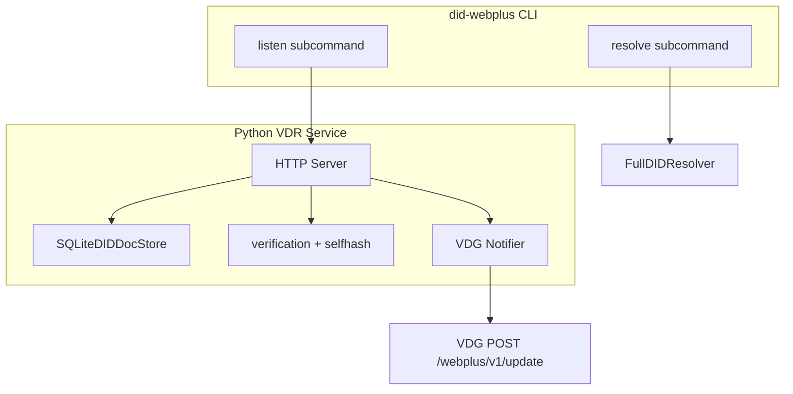

# did:webplus VDR Service Implementation Plan

## Summary

Add a Verifiable Data Registry (VDR) service to the existing Python did:webplus implementation, restructure the CLI so resolution and VDR listen mode are subcommands, and create Docker-based interoperability tests with the Rust reference implementation. **The VDR will use the same `DIDDocStore` / `SQLiteDIDDocStore` implementation as the existing DID resolver** — no separate VDR-specific store.

---

## 1. VDR Specification Requirements (from [did-webplus-spec](https://ledgerdomain.github.io/did-webplus-spec))

### HTTP Endpoints


| Method | Path                          | Purpose                                                                 |
| ------ | ----------------------------- | ----------------------------------------------------------------------- |
| GET    | `/{path}/did-documents.jsonl` | Serve microledger; MUST support `Range: bytes=N-` for incremental fetch |
| POST   | `/{path}/did-documents.jsonl` | DID Create (root document)                                              |
| PUT    | `/{path}/did-documents.jsonl` | DID Update (non-root document)                                          |
| GET    | `/health`                     | Health check (Rust convention)                                          |


Path format: `{host}:{port?}/{path_segments}/{root_self_hash}/did-documents.jsonl` maps from DID per spec (e.g. `did:webplus:example.com:uHiA...C8A` -> `https://example.com/uHiA...C8A/did-documents.jsonl`).

### Verification Checks (VDR MUST perform)

- **Root document**: self-hash, `versionId`=0, `prevDIDDocumentSelfHash` omitted, `selfSignatureVerifier` in `capabilityInvocation`
- **Non-root document**: self-hash, chain constraints (`prevDIDDocumentSelfHash`, `versionId`+1, `validFrom` strictly later), proofs satisfy `updateRules` of previous document
- **Domain consistency**: DID's host, port, path MUST match VDR's configured service domain

### VDG Notifications

- After successful POST (create) or PUT (update), VDR POSTs to `{vdg_base_url}/webplus/v1/update/{url_encoded_did}` (no body)
- Config: `DID_WEBPLUS_VDR_VDG_HOSTS` (comma-separated URLs)
- Scheme: https by default, http for localhost

---

## 2. Architecture Overview




---

## 3. Implementation Tasks

### 3.1 Extend Store for VDR Use

**File:** [did_webplus/store.py](did_webplus/store.py)

**Important:** The VDR uses the same `SQLiteDIDDocStore` (and `DIDDocStore` protocol) as the existing resolver. We extend this shared store with VDR-serving methods; we do not create a separate VDR store.

- Add `get_microledger_jsonl(did: str) -> str` returning newline-delimited JCS documents in version order
- Add `get_microledger_octet_length(did: str) -> int` for `Content-Range` and Range handling
- Add `get_microledger_from_byte_offset(did: str, offset: int) -> str` for Range-based GET (return substring from offset)
- Ensure `add_did_documents` remains idempotent and supports both create (prev_octet_length=0) and append (update)

### 3.2 VDR Service Module

**New file:** `did_webplus/vdr.py`

- **Store**: Use `SQLiteDIDDocStore` (same as resolver) for persistence. The VDR and resolver share the same storage layer.
- **Path-to-DID mapping**: Parse request path to derive DID (reverse of `DIDComponents.resolution_url()`). Handle `/{path_segments}/{root_self_hash}/did-documents.jsonl`.
- **Route handlers**:
  - `GET /{...}/did-documents.jsonl`: Return microledger; support `Range: bytes=N-`; respond with 206 + `Content-Range` or 200 as appropriate; 416 if range not satisfiable
  - `POST /{...}/did-documents.jsonl`: Parse body as single JCS root document; validate; check domain match; store; notify VDGs; return 200 or 4xx
  - `PUT /{...}/did-documents.jsonl`: Parse body as single JCS non-root document; validate; check prev exists; store; notify VDGs; return 200 or 4xx
  - `GET /health`: Return 200 OK
- **Validation**: Reuse `verify_self_hash`, `parse_did_document`, `verify_proofs`, `DIDDocument.verify_chain_constraints` from [did_webplus/verification.py](did_webplus/verification.py), [did_webplus/selfhash.py](did_webplus/selfhash.py), [did_webplus/document.py](did_webplus/document.py)
- **Domain check**: Compare DID host/port/path to VDR config (`did_hostname`, `did_port`, `path_prefix`)
- **VDG notifier**: Async HTTP POST to each `DID_WEBPLUS_VDR_VDG_HOSTS` URL; fire-and-forget (log errors, do not block response)

### 3.3 HTTP Server Choice

Use **FastAPI** for the VDR HTTP service (ASGI, async). Add `fastapi` and `uvicorn[standard]` to dependencies. Run with `uvicorn` in listen mode.

### 3.4 CLI Restructure

**File:** [did_webplus/cli.py](did_webplus/cli.py)

- Change from single command to multi-command Typer app:
  - `did-webplus resolve <did> [options]` — existing resolution logic (move current `resolve_cmd` here)
  - `did-webplus listen [options]` — start VDR HTTP server
- Listen options: `--host`, `--port`, `--store`, `--did-hostname`, `--did-port`, `--vdg-hosts`, `--path-prefix`
- Env vars: `DID_WEBPLUS_VDR`_* for VDR-specific config

### 3.5 VDR Config

Support env vars aligned with Rust VDR:

- `DID_WEBPLUS_VDR_DID_HOSTNAME` (required)
- `DID_WEBPLUS_VDR_DID_PORT` (optional)
- `DID_WEBPLUS_VDR_LISTEN_PORT` (default 8085)
- `DID_WEBPLUS_VDR_VDG_HOSTS` (comma-separated)
- `DID_WEBPLUS_STORE` for SQLite path

---

## 4. Interoperability Testing

### 4.1 Docker Setup

**New directory:** `interop/`

- `interop/docker-compose.yml` — define services:
  - `rust-vdr` — Use public image `ghcr.io/ledgerdomain/did-webplus-vdr-v0.1.0-rc.0`
  - `rust-vdg` — Use public image `ghcr.io/ledgerdomain/did-webplus-vdg-v0.1.0-rc.0` (for scenarios with VDG)
  - `python-vdr` — Python VDR (build from this repo via `Dockerfile.python-vdr`)
  - Test runner container or host-based tests that call services
- No submodule or local Rust build required; use the published images directly.

### 4.2 Test Matrix


| Scenario | Resolver | VDR    | VDG  |
| -------- | -------- | ------ | ---- |
| 1        | Python   | Rust   | None |
| 2        | Python   | Rust   | Rust |
| 3        | Rust     | Python | None |
| 4        | Rust     | Python | Rust |


### 4.3 Test Flow (each scenario)

**Base flow (all scenarios):**

1. Start VDR (and optionally VDG) via docker-compose
2. Create a DID via Rust CLI (or Python if we add create support to CLI) against the VDR
3. Resolve the DID using the resolver under test (Python CLI or Rust CLI)
4. Update the DID
5. Resolve again, verify latest document
6. Resolve by `versionId` and `selfHash` query params

### 4.4 VDG Push-Update Testing (Scenarios 2 and 4)

When the Rust VDG is present, incorporate tests patterned after [test_vdg_wallet_operations_impl](https://github.com/LedgerDomain/did-webplus/blob/main/did-webplus/vdg-lib/tests/did_webplus_vdg_lib_tests.rs) to verify the VDR's "push updates to VDG" behavior and VDG response semantics.

**VDG resolution URL:** `GET {vdg_base_url}/webplus/v1/resolve/{did}` (with optional `?versionId=N` and `?selfHash=...` query params).

**VDG response headers to assert:**


| Header                        | Expected value                                                       |
| ----------------------------- | -------------------------------------------------------------------- |
| `Cache-Control`               | `public, max-age=0, no-cache, no-transform`                          |
| `Last-Modified`               | Present                                                              |
| `ETag`                        | Equal to the resolved DID document's `selfHash`                      |
| `X-DID-Webplus-VDG-Cache-Hit` | `false` when VDG fetched from VDR; `true` when served from VDG cache |


**Push-update verification flow:**

1. Create DID via VDR (POST), update several times via VDR (PUT)
2. Sleep briefly (~100–500 ms) for VDG to receive notification and fetch
3. Resolve latest via VDG — first request may be cache miss (`X-DID-Webplus-VDG-Cache-Hit: false`)
4. Resolve again — cache hit (`X-DID-Webplus-VDG-Cache-Hit: true`)
5. Resolve with `?versionId=N` (known to exist) — cache hit
6. Resolve with `?selfHash={doc.self_hash}` — cache hit
7. Resolve with both `?selfHash=X&versionId=Y` (consistent) — cache hit
8. Resolve with both `?selfHash=X&versionId=0` (inconsistent, e.g. versionId 0 vs non-root selfHash) — expect **422 Unprocessable Entity**
9. Resolve with `?versionId=3&selfHash=XXXX` (bad selfHash) — expect **400 Bad Request**
10. Resolve with `?versionId=999` (version not yet in VDG) — expect **404 Not Found**
11. Update DID again on VDR (new versionId)
12. Sleep for VDG notification
13. Resolve the new versionId via VDG — expect **200 OK** with cache hit (proves VDR notified VDG and VDG fetched)

**Auth (if Rust VDG uses test-authz):** When `VDR_TEST_AUTHZ_API_KEYS` or equivalent is set, pass `x-api-key` header. Bad keys should yield 401 or 400.

### 4.5 Test Script

**New file:** `interop/run_interop_tests.sh` (or `interop/run_interop_tests.py`)

- Accept scenario selector (1–4)
- Use `docker compose up` for services
- Run test steps via `curl` or `httpx` for HTTP, and `did-webplus resolve` or Rust CLI for resolution
- For scenarios 2 and 4: run the full VDG push-update test flow (section 4.4) and assert headers and status codes
- Assert expected responses

---

## 5. File Structure (New/Modified)

```
poc-did-webplus-py/
├── did_webplus/
│   ├── cli.py          # Refactor: resolve + listen subcommands
│   ├── store.py        # Add get_microledger_*, get from byte offset
│   ├── vdr.py          # NEW: VDR HTTP service, path routing, validation, VDG notify
│   └── ...
├── interop/
│   ├── docker-compose.yml      # Rust VDR, Rust VDG, Python VDR services
│   ├── Dockerfile.python-vdr   # Python VDR container
│   ├── run_interop_tests.sh    # Test runner
│   └── README.md               # How to run interop tests
├── pyproject.toml      # Add fastapi, uvicorn
└── README.md           # Document listen subcommand, interop
```

---

## 6. Rust Reference Implementation Notes

- **Rust VDR** uses PostgreSQL by default; Python will use SQLite. Interop is via HTTP only — storage format is equivalent (did-documents.jsonl).
- **Rust VDG** expects `POST /webplus/v1/update/{did}` with URL-encoded DID (e.g. `did%3Awebplus%3Aeg.co%3AuHiA...C8A`).
- **Rust VDG** resolution: `GET /webplus/v1/resolve/{did}` with optional `?versionId=` and `?selfHash=` query params. Returns DID document JSON with headers `Cache-Control`, `Last-Modified`, `ETag`, `X-DID-Webplus-VDG-Cache-Hit` (see [vdg-lib tests](https://github.com/LedgerDomain/did-webplus/blob/main/did-webplus/vdg-lib/tests/did_webplus_vdg_lib_tests.rs)).
- **Rust VDR** listens on configurable port; docker-compose maps 8085. Python VDR should use same port for parity in interop.
- **Resolution URL** must match exactly: `https://{host}/{path}/{root_self_hash}/did-documents.jsonl` (or http for localhost).

---

## 7. Dependencies

Add to `pyproject.toml`:

- `fastapi` and `uvicorn[standard]` for ASGI server
- `httpx` (already present) for VDG notifications

---

## 8. Order of Implementation

1. Extend store with microledger/range methods
2. Implement VDR service (`vdr.py`) with routing, validation, VDG notify
3. Add `listen` subcommand to CLI
4. Add Dockerfile for Python VDR
5. Create interop docker-compose and test script
6. Run and fix interop tests for all 4 scenarios

